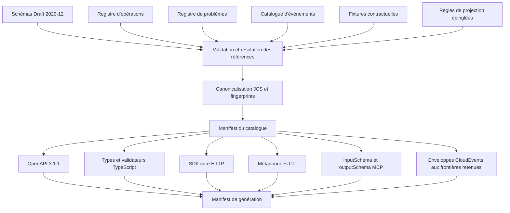

# Système de contrats — cible V1

- Statut : **spécification de conception acceptée pour `CONTRACT-001` via RFC-0001 et ADR-0004**
- Date : **2026-07-17**
- Réalité actuelle : **candidat V1 headless local ; vingt-deux opérations
  canoniques, verticales company, shortlist Contact, identité et email
  sélectionnés, export de dataset et lifecycle durable local de livraison sont
  composés, tandis que la publication, SSE, le serveur MCP et la compatibilité
  générale restent ouverts**

## Objet

Ce document transforme la décision de l'ADR-0003 en une spécification
exécutable pour le futur système de contrats de Kurobara. Il fixe la structure
du catalogue, les règles de propriété des sources et des outputs, le graphe de
génération, les axes de version, la compatibilité et les preuves attendues avant
qu'une surface puisse être annoncée comme conforme.

La décision retient un système où REST, le SDK TypeScript, la CLI et MCP présentent les
mêmes opérations métier sans recopier leurs schémas, leurs erreurs ou leurs
règles d'autorisation. JSON Schema Draft 2020-12 décrit les données publiques ;
les invariants impossibles à exprimer dans un schéma restent dans le domaine et
sont exercés par une suite de conformité commune.

Les choix détaillés d'URI, de catalogue, de compatibilité et de mapping public
ont été acceptés par
[RFC-0001](../rfcs/0001-v1-module-contract-domain-baseline.md) et résumés dans
[ADR-0004](../adr/0004-v1-module-contract-domain-baseline.md).

## Principes obligatoires

1. Un modèle public possède une source canonique unique en JSON Schema Draft
   2020-12.
2. Un document OpenAPI, un type TypeScript, un schéma Zod, une option CLI ou un
   descripteur MCP est une projection ou un consommateur, jamais une seconde
   source de vérité.
3. Une opération publique référence ses schémas par identifiant exact ; elle ne
   recopie pas leur structure.
4. Les règles métier, l'autorisation, le budget et les transitions d'état ne
   sont pas encodés uniquement dans un schéma ni réimplémentés par une surface.
5. Tout artefact publié est immuable, traçable jusqu'à un catalogue précis et
   reproductible sans réseau ni donnée locale implicite.
6. Une compatibilité est évaluée dans le sens réel producteur vers consommateur,
   pas déduite du seul aspect syntaxique d'un diff.
7. Une erreur conserve la même identité métier sur toutes les surfaces.
8. Les métadonnées d'autorité, de classification et d'expurgation sont des
   obligations contractuelles lorsqu'elles conditionnent un traitement ; elles
   ne remplacent jamais l'autorisation serveur.

## Réalité de l'implémentation

Le package `@kurobara/contracts` ne possède plus de racine historique. Sa
racine et le subpath explicite `@kurobara/contracts/v1` exposent la même
projection TypeScript générée depuis `packages/contracts/catalog`.

| Surface | État démontré | Limite actuelle |
| --- | --- | --- |
| Catalogue JSON Schema | Le catalogue `0.12.0` suivi contient 119 membres : vingt-deux opérations, soixante et un schémas, trente-deux problèmes, un événement et trois règles de projection. Son fingerprint source est `sha256:e71489cc76d8e5cd9de5fbf57913402e4310431786ca4dd53bc5b2e069c87afd`. Les schémas plugin locaux sont `PluginManifest`, `PluginProtocolMessage`, `PluginSidecarJsonRpcFrame` et `PluginConformanceReport` ; ils ne créent aucune opération publique. | Namespace `.invalid` réservé au développement local. |
| Génération | Manifestes, fingerprints, OpenAPI 3.1.1, types TypeScript, registre de problèmes, vingt-deux commandes CLI contractuelles et cinq descripteurs MCP sont reproductibles sans réseau. Le compilateur distingue une sortie JSON d'un stream CSV/JSONL. Le profil de conformité plugin `1.1.0` référence la matrice `sha256:4f0f6b375201f3b94f1458147b989c1aa9cd5858de63d4ffbd09eeb23e5e2b95`. | Qualification complète Draft 2020-12 et matrice de compatibilité générale encore ouvertes ; la matrice exacte ne couvre que Node 24.14.0 sur `darwin/arm64` et `linux/x64`. |
| API HTTP | Les vingt-deux opérations valident leur frontière canonique. L'import, les recettes/runs, la verticale company, `contacts.discover`, la lecture paginée des contacts prêts, `contacts.identity.reveal`, les deux opérations d'email, `datasets.export`, la lecture/révocation d'une livraison et la restriction Contact sont composés. Le scheduler règle une annulation active seulement après fermeture prouvée de chaque effet et réservation. | Profil distant, SSE, publication et support public restent absents. |
| SDK et CLI | Le client TypeScript partage les vingt-deux contrats. La CLI exécutable couvre notamment `company search/results/watch/cancel`, `contact search/results/reveal-identity/enrich-email/verify-email/restrict` et `dataset export/export-status/export-revoke`. | `capabilities`, `quote`, `run create` et `run get` restent seulement des commandes contractuelles ; packaging distribuable et parcours publié restent ouverts. |
| MCP | Les opérations éligibles dérivent toujours du catalogue ; `datasets.import`, `recipes.apply`, `recipe-applications.get` et `recipe-applications.export` sont explicitement différées. | Aucun serveur MCP exécutable n'est présent tant que `MCP-001` n'est pas implémenté ; le stream d'export n'a pas de transport MCP borné. |

[RFC-0008](../rfcs/0008-provider-neutral-dataset-generation.md) a introduit la
famille provider-neutral désormais matérialisée dans le catalogue par
`organizations.discover`, `organizations.candidates.list`,
`dataset-generations.get/cancel` et les contrats Contact. La verticale company
est composée ; `organizations.candidates.list` expose seulement les candidats
provider-neutral d'une matérialisation `ready`, par curseur ordinal borné.
`contacts.discover` dérive une génération bornée depuis le snapshot immuable du
dataset Entreprises parent ; `contacts.candidates.list` lit les résultats prêts.
[RFC-0011](../rfcs/0011-selected-contact-derived-datasets.md) ajoute les datasets
dérivés sélectionnés : Apollo révèle l'identité professionnelle, Hunter Finder
résout l'email, Hunter Verifier le vérifie à la demande, puis `datasets.export`
streame le résultat final en CSV ou JSONL. Les routes sélectionnées ne sont
composées qu'avec la clé provider correspondante et un
`KUROBARA_CONTACT_PRIVACY_HMAC_SECRET` stable d'au moins 32 octets ; sa version
optionnelle vaut `v1` par défaut. L'export d'un dataset Contact exige
`datasets:export` et `contacts:export`. Les tombstones sont contrôlés en preflight
et juste avant l'effet, puis avant et pendant le stream. Ce contrôle ne fournit
pas encore le registre durable de livraison, le TTL ni le cycle complet des
droits provider. La projection publique n'expose ni provider ID, receipt,
cursor fournisseur, ni query traduite.

L'ancien OpenAPI d'enrichissement, ses types et ses consommateurs ont été
supprimés. Ils ne constituent plus une seconde source de vérité ni une surface
annonçable.

## Catalogue canonique cible

### Arborescence logique

La cible place le catalogue sous le package de contrats, avec une séparation
visible entre sources écrites, fixtures et outputs générés :

```text
packages/contracts/
└── catalog/
    ├── schemas/
    │   └── <family>/<name>/<semver>.schema.json
    ├── operations/
    │   └── <operation-id>/<semver>.operation.json
    ├── problems/
    │   └── <problem-code>/<semver>.problem.json
    ├── events/
    │   └── <event-type>/<semver>.event.json
    ├── fixtures/
    │   └── <schema-name>/{valid,invalid}/<case>.json
    ├── projection-rules/
    │   └── <surface>.json
    └── generated/
        ├── catalog-manifest.json
        ├── openapi-3.1.1.json
        ├── typescript/
        ├── sdk-core/
        ├── cli/
        ├── mcp/
        └── generation-manifest.json
```

Les noms de répertoires sont en `kebab-case`. Les noms sérialisés déjà publics
restent stables ; pour les nouveaux objets V1, les propriétés JSON utilisent
`snake_case`, les identifiants d'opération utilisent une forme qualifiée comme
`runs.create`, et les projections traduisent seulement l'ergonomie de surface.
Une traduction ne change jamais le sens d'un champ.

### Identité d'un schéma

Chaque fichier sous `schemas/` :

- déclare exactement
  `"$schema": "https://json-schema.org/draft/2020-12/schema"` ;
- possède un `$id` absolu et immuable sous la forme
  `https://schemas.kurobara.dev/schemas/<family>/<name>/<semver>` ;
- déclare un `title`, une description publique, une version SemVer et un
  propriétaire fonctionnel stable comme une couche ou un module, jamais une
  personne ;
- référence les autres schémas par leur `$id` complet, version incluse ;
- utilise `family` et `name` en `kebab-case` ASCII et une SemVer canonique sans
  préfixe `v` ;
- ne contient ni fragment, query, extension de fichier, version produit,
  version de catalogue ou alias flottant `latest` ;
- n'utilise aucune référence dépendant du chemin de la machine ;
- définit explicitement la politique des propriétés inconnues et la stratégie
  d'extensibilité applicable ;
- contient uniquement des exemples synthétiques ou référence des fixtures
  validées.

Un même `$id` ne peut jamais désigner deux suites d'octets différentes. Une
correction, même compatible, reçoit une nouvelle version et une nouvelle
empreinte. Le résolveur du catalogue associe les URI aux fichiers inclus dans le
manifest ; la génération n'a pas besoin de résoudre ces identifiants sur le
réseau.

La première publication est interdite tant que le projet n'a pas prouvé le
contrôle durable de `kurobara.dev`. Si ce contrôle ne peut pas être établi, un
autre domaine effectivement contrôlé doit être choisi avant le premier `$id`
public. L'identité de remplacement est fixée par mise à jour RFC/ADR avant toute
publication ; un namespace `urn:kurobara` non enregistré n'est pas un fallback.

Le domaine ne transporte pas ces documents. Il conserve une `ContractRef`
opaque composée au minimum de `catalog_version`, `catalog_fingerprint`,
`schema_id`, `schema_version` et `schema_fingerprint`. Les adapters et frontières
contractuelles résolvent et valident les octets correspondants ; l'application
ne reçoit qu'une `ContractRef` et une valeur interne validée. Ni le kernel ni
les moteurs purs n'importent JSON Schema ou un validateur généré.

### Registres adjacents

Les registres d'opérations, de problèmes et d'événements sont des sources
écrites, mais ne redéfinissent aucun payload : ils référencent exclusivement les
`$id` canoniques.

Une entrée d'opération contient au minimum :

- un `operation_id` stable et sa version ;
- une référence stable d'action applicative ou de query, vérifiée par la suite
  de conformité sans créer d'import depuis `contracts` vers le domaine ;
- le `$id` d'entrée, exactement un `$id` de sortie JSON ou un descripteur de
  stream, et les problèmes possibles ;
- son caractère lecture ou mutation, son profil d'idempotence et la présence
  éventuelle d'un flux ;
- les capabilities, permissions et gates humains requis ;
- les classes de données admises et produites ;
- les noms et paramètres strictement ergonomiques des projections REST, SDK,
  CLI et MCP ;
- son statut stable, expérimental ou déprécié.

Les chemins HTTP, noms de méthodes, commandes et noms de tools vivent donc dans
le registre d'opérations. La structure de leurs entrées et sorties reste dans
JSON Schema.

## Propriété des sources et des outputs

| Élément | Propriété | Modification autorisée |
| --- | --- | --- |
| Schémas Draft 2020-12 | Écrit et revu | Toute évolution passe par compatibilité, version et fixtures. |
| Registres opérations/problèmes/événements | Écrits et revus | Ils peuvent ajouter des métadonnées ou références sans recopier un schéma. |
| Règles de projection | Écrites et revues | Elles décrivent une convention de transport ; elles ne portent aucune règle métier. |
| Fixtures valides et invalides | Écrites et revues | Elles sont synthétiques, minimales, déterministes et reliées à un schéma exact. |
| OpenAPI 3.1.1 | Généré | Jamais corrigé à la main ; une erreur se corrige dans la source ou la règle de projection. |
| Types et validateurs TypeScript | Générés | Aucun patch local ; un wrapper peut les importer sans les redéfinir. |
| SDK core HTTP | Généré | Le wrapper ergonomique est écrit, mais ne change ni validation, ni problème, ni idempotence. |
| Métadonnées CLI | Générées | Le rendu humain et l'interaction terminal peuvent être écrits autour des métadonnées. |
| Schémas et descripteurs MCP | Générés | Le serveur compose transport `stdio`, projections et SDK HTTP ; l'API reste propriétaire des use cases et de l'autorisation. |
| Manifests et empreintes | Générés | Toute modification manuelle invalide la preuve de génération. |

Les outputs générés portent un en-tête ou une métadonnée machine qui identifie
le générateur, sa version, le fingerprint du catalogue et l'interdiction de
modifier le fichier directement. Un wrapper écrit peut compléter une surface,
mais un test de parité doit prouver qu'il n'altère pas le contrat généré.

## Graphe de génération



L'ordre cible est strict :

1. valider le dialecte, les identifiants, les métadonnées et toutes les
   références ;
2. valider les fixtures positives et vérifier que chaque fixture négative
   échoue pour la raison annoncée ;
3. vérifier la cohérence entre opérations, problèmes, événements, autorité et
   classifications ;
4. canonicaliser, empreinter et construire le manifest ordonné ;
5. produire toutes les projections dans un répertoire propre ;
6. revalider chaque projection et ses références ;
7. exécuter la suite de parité sur les adaptateurs déclarés conformes ;
8. comparer les outputs aux artifacts suivis et refuser tout drift ;
9. générer le manifest final avec hashes des outputs et versions des outils.

Aucune projection ne sert d'entrée à une autre projection lorsque cela pourrait
perdre du sens. Le SDK, la CLI et MCP ne dérivent donc pas leur modèle de données
depuis OpenAPI : ils partent du même manifest canonique. OpenAPI peut fournir le
mapping HTTP au SDK core, mais jamais remplacer le schéma source.

## Chaîne d'outillage retenue

Un package interne `@kurobara/contract-compiler` orchestre la génération. Il est
la seule entrée mutante de la chaîne et ne résout aucune référence sur le
réseau. Les versions qualifiées au moment de la décision sont :

| Responsabilité | Moteur initial | Limite obligatoire |
| --- | --- | --- |
| Parsing JSON strict | `@humanwhocodes/momoa@3.3.10` | Refuser clés dupliquées et documents non I-JSON avant JCS. |
| Draft 2020-12, références, bundles et annotations | `@hyperjump/json-schema@1.17.7` | Résolution depuis le registre local de `$id` uniquement. |
| Validateurs TypeScript de runtime | `ajv@8.20.0` avec `ajv-formats@3.0.1` | `Ajv2020`, strict mode, vocabulaire Kurobara enregistré et modules standalone ESM. |
| Déclarations TypeScript | `json-schema-to-typescript@15.0.4` | Profil de mots-clés borné ; tout sens non projetable bloque la génération. |
| Canonicalisation | `canonicalize@3.0.0` | Vecteurs RFC 8785, UTF-8 puis SHA-256. |
| Qualification OpenAPI | `@redocly/cli@2.39.0` | Lint strict de l'output OpenAPI 3.1.1, jamais source canonique. |

Les versions exactes entrent dans le lockfile et le manifest de génération lors
de `CONTRACT-001`. Une mise à jour de moteur est un changement de dépendance
testé ; elle n'exige pas un RFC si les mêmes sources, annotations, octets,
empreintes et gates restent prouvés.

Le compilateur produit séparément OpenAPI, types, validateurs, SDK core natif
`fetch`, métadonnées Commander et descripteurs MCP depuis le manifest et les
registres. Pour MCP `2025-11-25`, les racines d'entrée et de sortie restent des
objets, le serveur utilise les descripteurs JSON Schema bruts et AJV à la
frontière, et un fallback texte accompagne `structuredContent`. Une API de SDK
qui reconvertit un schéma Zod ne devient pas une source alternative.

### Conservation des annotations

Le meta-schéma Kurobara enregistre au minimum
`x-kurobara-data-classification`, `x-kurobara-redaction`,
`x-kurobara-authority-scope`, `x-kurobara-enum-profile` et
`x-kurobara-known-values`. Un `annotation-index.json` relie chaque `$id` et JSON
Pointer à son traitement OpenAPI, SDK, CLI et MCP.

OpenAPI conserve les annotations ; SDK et CLI en dérivent décodage et rendu sûr ;
MCP mappe les sémantiques standards vers ses annotations et place les extensions
Kurobara dans un `_meta` namespacé. Aucune annotation n'accorde une permission.
La génération échoue si une annotation disparaît, s'affaiblit ou n'a pas de
traitement déclaré sur une surface.

Pour une enum de données reçue explicitement extensible, le producteur reste
strict sur les valeurs connues tandis que le décodeur consommateur conserve une
valeur inconnue sous une forme discriminée avec sa chaîne brute. États, autorité,
terminalité et actions permises restent des enums fermées.

## Invariants au-delà de JSON Schema

JSON Schema vérifie une forme locale. Les invariants suivants appartiennent au
kernel ou à la couche application et sont testés avec les mêmes scénarios sur
chaque surface :

- une transition de run est valide pour son état et sa version courants ;
- l'idempotency key désigne la même intention normalisée ou produit un conflit ;
- `spent + reserved` ne dépasse pas le budget autorisé malgré la concurrence ;
- une deadline enfant ne dépasse jamais celle du parent ;
- capabilities, portées de données et permissions d'un enfant sont une
  réduction monotone de son enveloppe parente ;
- un signal humain correspond au workspace, au run, à l'étape, à l'action et à
  une identité autorisée ;
- une quote reste valide, non expirée et compatible avec le plan accepté ;
- un effet ambigu bloque une nouvelle dépense jusqu'à réconciliation ;
- la pagination, la séquence d'événements et l'identité des artifacts restent
  cohérentes avec l'état durable ;
- une donnée marquée sensible n'apparaît pas dans un problème, un log ou une
  projection qui n'est pas autorisée à la révéler.

Un schéma peut exiger `budget`, `deadline` ou `authority`, mais il ne peut pas
prouver leur cohérence avec le ledger, l'horloge, le parent ou le workspace.

## Axes de version

| Axe | Sens | Règle cible |
| --- | --- | --- |
| Version produit | Ensemble de fonctionnalités livré sous le nom Kurobara | Peut agréger plusieurs versions compatibles de catalogue et de packages. |
| Version du catalogue | Ensemble exact des schémas et registres | SemVer ; son manifest immuable énumère chaque membre et son empreinte. |
| Version de schéma | Contrat d'un payload précis | SemVer indépendante ; elle figure dans le `$id`. |
| Version de capability | Sens métier, contrats d'entrée/sortie et classes d'effet d'une capability | Indépendante des opérations de contrôle ; toute `CapabilityRef` fige cette version. |
| Version d'opération | Sens et projections d'une capacité publique | Évolue quand le mapping, les problèmes ou la sémantique contractuelle changent. |
| Version HTTP | Espace de chemins tel que `/v1` | Ne change que pour une rupture de la surface HTTP ; elle n'est pas la version produit. |
| Version de workflow | Forme et sémantique d'un `WorkflowSpec` ou d'un `RunPlan` | Figer cette version dans tout plan exécutable. |
| Version d'API plugin | Contrat entre le cœur et un adapter | Évolue indépendamment des routes publiques. |
| Version de package | Artefact npm CLI, SDK, MCP ou contrats | SemVer du package ; il embarque le catalogue exact dont il est issu. |

Une version de package ne doit pas être interprétée comme une version de
catalogue. Deux packages de versions différentes peuvent embarquer le même
catalogue ; deux builds d'une même version de package ne peuvent pas embarquer
deux fingerprints différents.

## Canonicalisation, empreintes et manifests

Chaque document JSON empreinté est canonicalisé selon
[RFC 8785 — JSON Canonicalization Scheme](https://www.rfc-editor.org/rfc/rfc8785.html),
puis hashé en SHA-256. Le manifest du catalogue contient, dans un ordre binaire
stable par `$id` :

- l'identifiant, la version, le rôle et le media type de chaque membre ;
- son hash JCS SHA-256 et ses dépendances exactes ;
- la version du dialecte JSON Schema ;
- les versions des standards, règles de projection et générateurs ;
- le niveau de conformité déclaré pour chaque surface.

Le `catalog_fingerprint` est le SHA-256 de la représentation JCS du manifest
sans le champ qui porte cette empreinte. Cette convention évite tout hash
autoréférentiel. Le manifest de génération ajoute le hash des outputs, la
version du runtime de build et le fingerprint source.

La génération exclut les timestamps, chemins absolus, ordre de fichiers du
système, locale, timezone, identifiant de machine et accès réseau. Deux
générations propres à partir des mêmes sources et outils doivent produire les
mêmes octets.

## Profil de compatibilité producteur/consommateur

Le **producteur** sérialise une donnée ; le **consommateur** la reçoit. Pour une
commande, le client est producteur et le service consommateur. Pour un résultat,
un problème ou un événement, le service est producteur et le client
consommateur.

Le profil V1 applique ces règles :

- les objets d'entrée sont fermés afin que le service refuse les fautes de
  frappe et propriétés non prévues ;
- les producteurs valident strictement leurs sorties contre la version qu'ils
  annoncent ;
- les consommateurs générés de résultats, problèmes et événements conservent
  les champs inconnus et n'échouent pas sur un ajout optionnel ;
- une enum de données explicitement extensible reçue prévoit une représentation
  `unknown` qui préserve la valeur brute, alors qu'une enum émise reste limitée
  aux valeurs connues ;
- les états de run, step et tentative, ainsi que les enums d'autorité, de
  terminalité ou d'action permise, restent fermés : une valeur inconnue ne peut
  pas être traitée comme une simple extension sûre ;
- un champ requis ne reçoit jamais une valeur par défaut silencieuse dans une
  projection ; la normalisation appartient à un use case explicite ;
- une extension libre vit dans un objet `extensions` namespacé et borné, pas
  dans des propriétés arbitraires au sommet du payload.

| Évolution | Ancien producteur vers nouveau consommateur | Nouveau producteur vers ancien consommateur | Classe par défaut |
| --- | --- | --- | --- |
| Ajouter un champ d'entrée optionnel | Accepté par le nouveau service. | Un nouveau client qui l'émet peut être refusé par un ancien service. | `MINOR` pour le service ; le SDK doit négocier ou cibler une version compatible. |
| Ajouter un champ d'entrée requis | L'ancien client ne le fournit pas. | Sans objet. | `MAJOR`. |
| Supprimer ou refuser un ancien champ d'entrée | L'ancien client peut encore l'envoyer. | Sans objet. | `MAJOR`. |
| Élargir une contrainte d'entrée | Les anciennes valeurs restent admises. | Les nouvelles valeurs peuvent être refusées par l'ancien service. | `MINOR`, sous la même règle de ciblage. |
| Rétrécir une contrainte d'entrée | Une ancienne valeur valide peut être refusée. | Sans objet. | `MAJOR`. |
| Ajouter un champ de sortie optionnel | Sans objet. | L'ancien consommateur tolérant l'ignore ou le conserve. | `MINOR`. |
| Ajouter un champ de sortie requis sans valeur définie auparavant | L'ancien résultat n'est plus valide pour le nouveau consommateur strict. | L'ancien consommateur tolérant peut l'ignorer. | `MAJOR`, car le replay historique casse. |
| Supprimer ou rendre optionnel un champ de sortie requis | Sans objet. | L'ancien consommateur peut dépendre du champ. | `MAJOR`. |
| Ajouter une valeur d'enum de données extensible | Sans objet. | L'ancien consommateur reçoit `unknown` avec la valeur brute. | `MINOR` si le profil tolérant est prouvé. |
| Ajouter un état ou une valeur d'enum de contrôle | L'ancien producteur ne connaît pas la nouvelle sémantique. | L'ancien consommateur ne sait pas conclure terminalité ou actions sûres. | `MAJOR` ou nouvelle version, sauf preuve spécifique de compatibilité comportementale. |
| Changer type, unité, devise ou sens d'un champ | Une interprétation existante devient fausse. | Une interprétation existante devient fausse. | `MAJOR`, même si le JSON reste valide. |
| Ajouter une opération, un problème ou un type d'événement | Les consommateurs existants restent valides avec leur fallback générique. | L'ancien consommateur ne doit pas avoir à le demander ou s'y abonner. | `MINOR` si le fallback est testé. |
| Modifier l'identité, le retry, l'idempotence, l'autorité ou un gate d'une opération | Le comportement de l'ancien client change. | Le nouveau client ne peut pas supposer l'ancien contrôle. | `MAJOR` ou nouvelle opération versionnée. |

Une évolution marquée `MINOR` n'est acceptée que si le test de compatibilité
confirme les deux directions garanties : un nouveau service accepte les anciens
inputs valides, et les anciens consommateurs générés acceptent les nouvelles
sorties compatibles. Une différence de documentation sans effet de validation
ou de sémantique peut être `PATCH`.

## Dépréciation

Une dépréciation est additive et apparaît dans le schéma, le registre
d'opérations et toutes les projections applicables. Elle indique au minimum la
version de catalogue d'introduction, la version de dépréciation, le remplacement
éventuel et une raison publique.

Un élément déprécié :

- reste fonctionnel pendant le major courant ;
- continue d'être généré et testé tant qu'il est supporté ;
- n'est jamais remplacé silencieusement par une sémantique différente ;
- ne peut être retiré qu'avec une version majeure ou une nouvelle opération
  explicitement versionnée.

Une correction de sécurité peut imposer un calendrier plus court, mais elle
reste documentée comme une rupture et suit le processus de sécurité ; elle ne se
déguise pas en changement compatible.

## Registre RFC 9457

Le catalogue définit un schéma de base `Problem` conforme à
[RFC 9457 — Problem Details for HTTP APIs](https://www.rfc-editor.org/rfc/rfc9457.html)
et un registre des familles de problème. Chaque entrée possède :

- un URI `type` stable, par exemple
  `https://schemas.kurobara.dev/schemas/problems/validation-failed/1.0.0` ;
- un `code` stable destiné aux machines ;
- un titre par défaut et une sémantique indépendante du transport ;
- le statut HTTP par défaut, le caractère retryable et les opérations qui
  peuvent l'émettre ;
- une liste fermée d'extensions publiques sûres ;
- le code de sortie CLI et le mapping MCP ;
- les règles d'expurgation et la classification maximale de chaque extension.

Le détail humain n'est pas une API et peut évoluer. Il ne contient ni trace,
secret, credential, donnée personnelle brute, payload fournisseur, requête SQL
ni chemin local. Un identifiant de corrélation opaque peut être exposé ; les
preuves détaillées restent dans un artifact protégé.

| Surface | Projection d'un même problème |
| --- | --- |
| REST | Corps `application/problem+json`, statut issu du registre et mêmes `type`/`code`. |
| SDK TypeScript | Exception typée contenant l'instance validée, le statut et un accès au fallback générique. |
| CLI JSON | Objet problème inchangé sur stdout ou stderr selon le contrat de commande, avec code de sortie déterministe. |
| CLI humain | Message concis dérivé du problème ; le parsing du message n'est jamais requis. |
| MCP | Résultat de tool en erreur avec contenu structuré validé et fallback JSON texte ; les erreurs de protocole restent distinctes des problèmes métier. |

Une surface ne peut transformer une autorisation refusée en erreur de
validation, ni masquer un état `ambiguous` derrière un timeout générique.

## Catalogue d'événements et frontière CloudEvents

Chaque événement public possède un type stable, une version, un `$id` de data,
un propriétaire, une source métier, une clé d'agrégat, un ordre attendu, une
classification et une politique de rétention. Le payload `data` reste un JSON
Schema canonique.

La projection est fermée par défaut. Un fait interne n'entre dans l'allowlist
que s'il est durable, observable, actionnable ou nécessaire à l'explicabilité,
indépendant du runtime/provider, minimal, expurgé, ordonné et associé à un
propriétaire, un schéma, une classification et une rétention.

| Événement interne | Type public V1 |
| --- | --- |
| `RunQueued` | `dev.kurobara.run.queued.v1` |
| `RunStarted` | `dev.kurobara.run.started.v1` |
| `InputRequested` | `dev.kurobara.run.input-requested.v1` |
| `RunWaiting` | `dev.kurobara.run.waiting.v1` |
| `InputRequestConsumed` | `dev.kurobara.run.input-consumed.v1` |
| `RunResumed` | `dev.kurobara.run.resumed.v1` |
| `RunStopRequested` | `dev.kurobara.run.stop-requested.v1` |
| `RunCancelling` | `dev.kurobara.run.cancelling.v1` |
| `ExternalEffectBecameAmbiguous` | `dev.kurobara.run.external-effect-ambiguous.v1` |
| `RunAmbiguous` | `dev.kurobara.run.ambiguous.v1` |
| `AmbiguityResolved` | `dev.kurobara.run.ambiguity-resolved.v1` |
| `RunCompleted` | `dev.kurobara.run.completed.v1` |
| `RunFailed` | `dev.kurobara.run.failed.v1` |
| `RunCancelled` | `dev.kurobara.run.cancelled.v1` |
| `RoutingDecisionRecorded` | `dev.kurobara.run.routing-decided.v1` |
| `ChildRunQueued` | `dev.kurobara.run.child-queued.v1` |
| `ChildResultAccepted` | `dev.kurobara.run.child-result-accepted.v1` |

Restent internes en V1 : signal humain accepté ou refusé et son contenu,
expiration de quote, ordonnancement de step/tentative, réservations et règlements
du ledger, détail transactionnel de délégation, heartbeats et messages de
transport. Les snapshots publics exposent seulement les coûts agrégés et faits
expurgés nécessaires.

Un changement de payload compatible conserve le type majeur et reçoit un
nouveau `$id` SemVer. Une rupture reçoit un nouveau type et un nouveau schéma
majeurs. La surface `/v1` ne retire ni ne réaffecte un type V1 et n'émet pas
silencieusement un type V2. Cette compatibilité dure toute la vie du major de
surface, sans durée calendaire implicite.

La projection possède `public_event_id` et séquence propres, puis reste conservée
aussi longtemps que le run. Après expiration du run, un curseur devenu invalide
retourne un problème RFC 9457 `410 Gone`; rétention des données et compatibilité
des schémas restent deux politiques distinctes. SSE n'adopte pas CloudEvents en
V1.

[CloudEvents 1.0.2](https://github.com/cloudevents/spec/tree/v1.0.2) est utilisé
seulement lorsqu'un événement traverse une frontière asynchrone où son enveloppe
améliore l'interopérabilité ou la déduplication. Dans ce cas :

- `specversion` est épinglé ;
- `id` est stable pour une même occurrence et la paire `source`/`id` est unique ;
- `source` est un URI logique stable tel qu'un composant ou workspace opaque,
  jamais une URL privée ou un nom de machine ;
- `type` inclut une famille et une version majeure stables ;
- `dataschema` référence le `$id` exact du payload ;
- `datacontenttype` est explicite ;
- la déduplication, l'ordre, la redelivery et la rétention sont documentés par
  frontière.

Les transitions internes du kernel, l'outbox métier et le journal durable ne
dépendent pas de CloudEvents. SSE projette le catalogue public et sa séquence de
run sans enveloppe CloudEvents en V1. Une future frontière webhook ou broker
pourra adopter cette enveloppe par contrat explicite, sans créer une seconde
taxonomie d'événements.

## Autorité, classification et expurgation

Les objets contractuels liés à un run ou une délégation référencent la version
de `AuthorityEnvelope` définie par le modèle d'autorité. Les opérations portent
des métadonnées générables :

- permissions et capabilities requises ;
- type de sujet et workspace attendus ;
- lecture, mutation, effet externe ou dépense possible ;
- gates humains et conditions d'idempotence ;
- classes de données admises, produites ou interdites ;
- politique de rétention et d'expurgation applicable aux problèmes, événements
  et traces.

Les annotations JSON Schema utilisent un namespace Kurobara explicite, par
exemple `x-kurobara-data-classification`, `x-kurobara-redaction` et
`x-kurobara-authority-scope`. Elles sont validées par le meta-schéma du
catalogue. Une projection doit les conserver lorsque sa surface les comprend ou
générer le contrôle correspondant ; elle ne peut pas les supprimer
silencieusement.

Ces annotations décrivent une obligation, pas une décision d'accès. Un client
qui déclare une permission, une classification plus faible ou un consentement
ne s'autorise pas lui-même. Le serveur recalcule l'autorité depuis l'identité,
le workspace, la policy et l'état durable.

Les classes minimales cibles sont `public`, `internal`, `confidential` et
`restricted`. Un changement vers une classe moins restrictive requiert une
revue de sécurité et de provenance ; il n'est jamais considéré comme une simple
extension compatible. Les valeurs sensibles de fixtures sont toujours
synthétiques, même pour tester l'expurgation.

## Matrice de parité V1

Le registre relie également chaque opération à une action applicative stable.
Cette référence est une identité de conformité, pas un import TypeScript depuis
le package de contrats vers l'application.

| Opération canonique | Action ou query applicative | Fait ou résultat métier attendu |
| --- | --- | --- |
| `capabilities.list` | `ListCapabilities` | catalogue filtré par workspace et autorité |
| `contacts.candidates.list` | `ListContactCandidates` | page ordinale bornée et privacy-safe d'une matérialisation Contact `ready` |
| `contacts.discover` | `DiscoverContacts` | shortlist bornée liée à un dataset d'entreprises et exécutée par pages durables |
| `contacts.identity.reveal` | `RevealSelectedContactIdentities` | dataset dérivé des identités professionnelles révélées pour un à trois contacts sélectionnés |
| `contacts.work-email.resolve` | `ResolveSelectedWorkEmails` | dataset dérivé des emails professionnels résolus pour les seuls contacts sélectionnés |
| `contacts.work-email.verify` | `VerifySelectedWorkEmails` | dataset dérivé de vérification explicitement demandé pour les seuls emails sélectionnés |
| `dataset-generations.cancel` | `RequestDatasetGenerationStop` | demande d'arrêt durable et idempotente d'une génération |
| `dataset-generations.get` | `GetDatasetGeneration` | snapshot durable et compteurs d'une génération |
| `datasets.export` | `ExportDataset` | stream CSV ou JSONL déterministe du dataset exact, avec autorité Contact renforcée le cas échéant |
| `datasets.import` | `ImportDataset` | dataset et records validés persistés par lots bornés |
| `organizations.candidates.list` | `ListOrganizationCandidates` | page ordinale bornée des candidats d'une matérialisation `ready` |
| `organizations.discover` | `DiscoverOrganizations` | plan ou génération d'entreprises depuis des filtres structurés |
| `plans.quote` | `QuoteRunPlan` | `RunPlan` et `CostQuote` préparés, sans création de run |
| `recipe-applications.export` | `ExportRecipeApplication` | téléchargement direct de la projection exacte, sans ressource d'export |
| `recipe-applications.get` | `GetRecipeApplicationStatus` | snapshot durable et compteurs d'une application |
| `recipes.apply` | `ApplyRecipe` | application et runs de cellule créés ou rejoués |
| `runs.cancel` | `RequestStop` | `RunStopRequested`, puis convergence selon l'état |
| `runs.create` | `CreateRunFromPlan` | `RunQueued` et `run_id` créés atomiquement |
| `runs.get` | `GetRun` | snapshot de lecture du run |

Le registre d'opérations génère la matrice suivante. Le nom ergonomique varie,
mais l'identité d'opération, les schémas, les problèmes, l'autorité et
l'idempotence restent communs.

| Opération canonique | REST | SDK TypeScript | CLI | MCP |
| --- | --- | --- | --- | --- |
| `capabilities.list` | `GET /v1/capabilities` | `capabilities.list()` | `capabilities` | `list_capabilities` |
| `contacts.candidates.list` | `GET /v1/dataset-generations/{generation_id}/contact-candidates` | `contacts.listCandidates()` | `contact results` | Différé |
| `contacts.discover` | `POST /v1/contact-discoveries` | `contacts.discover()` | `contact search` | Différé |
| `contacts.identity.reveal` | `POST /v1/contact-identity-reveals` | `contacts.revealIdentities()` | `contact reveal-identity` | Différé |
| `contacts.work-email.resolve` | `POST /v1/contact-work-email-resolutions` | `contacts.resolveWorkEmails()` | `contact enrich-email` | Différé |
| `contacts.work-email.verify` | `POST /v1/contact-work-email-verifications` | `contacts.verifyWorkEmails()` | `contact verify-email` | Différé |
| `dataset-generations.cancel` | `POST /v1/dataset-generations/{generation_id}/cancel` | `datasetGenerations.cancel()` | `company cancel` | Différé |
| `dataset-generations.get` | `GET /v1/dataset-generations/{generation_id}` | `datasetGenerations.get()` | `company watch` | Différé |
| `datasets.export` | `POST /v1/dataset-exports` | `datasets.export()` | `dataset export` | Différé : aucun transport d'artifact borné |
| `datasets.import` | `POST /v1/dataset-imports` | `datasets.import()` | `dataset import` | Différé : aucun transport d'import streamé borné |
| `organizations.candidates.list` | `GET /v1/dataset-generations/{generation_id}/company-candidates` | `organizations.listCandidates()` | `company results` | Différé |
| `organizations.discover` | `POST /v1/organization-discoveries` | `organizations.discover()` | `company search` | Différé |
| `plans.quote` | `POST /v1/plans` | `plans.quote()` | `quote` | `quote_run` |
| `recipe-applications.export` | `POST /v1/recipe-application-exports` | `recipeApplications.export()` | `recipe export` | Différé : aucun transport d'artifact borné |
| `recipe-applications.get` | `GET /v1/recipe-applications/{application_id}` | `recipeApplications.get()` | `recipe watch` | Différé |
| `recipes.apply` | `POST /v1/recipe-applications` | `recipes.apply()` | `recipe apply` | Différé |
| `runs.cancel` | `POST /v1/runs/{run_id}/cancel` | `runs.cancel()` | `run cancel` | `cancel_run` |
| `runs.create` | `POST /v1/runs` | `runs.create()` | `run create` | `create_run` |
| `runs.get` | `GET /v1/runs/{run_id}` | `runs.get()` | `run get` | `get_run` |

L'absence volontaire de streaming MCP V1 est une différence explicite, pas une
divergence métier : le tool retourne un `RunRef` ou un snapshot borné, puis le
client relit l'état. Les exports directs restent API, SDK et CLI-only jusqu'à la
définition d'un transport d'artifact MCP borné ; ce report ne crée pas un tool
JSON/base64. Toute autre exception à la matrice doit être versionnée, motivée et
testée avant publication.

## Fixtures et exemples sûrs

Chaque schéma important possède au minimum :

- une fixture valide minimale ;
- une fixture valide complète couvrant les extensions autorisées ;
- une fixture invalide par frontière critique avec le mot-clé attendu ;
- un cas de compatibilité issu de la dernière version publiée ;
- un cas cross-surface qui produit le même résultat ou le même problème.

Les exemples utilisent des UUID manifestement synthétiques, des domaines
réservés comme `example.invalid`, des montants fictifs et des identités non
plausibles. Ils ne contiennent jamais de token réaliste, email personnel, URL
privée, donnée copiée d'un fournisseur ou secret même révoqué.

Les fixtures ne dépendent ni de l'heure courante, ni d'un ordre aléatoire, ni du
réseau. Une fixture négative documente l'échec attendu sans figer un message
humain susceptible d'évoluer.

## Gates de drift et de reproductibilité

La future chaîne de qualification échoue si :

- un `$id` est absent, dupliqué, non versionné ou non résolu localement ;
- une fixture valide échoue, une fixture invalide passe ou son motif change sans
  revue ;
- une projection modifie le sens, les champs requis ou les annotations de
  sécurité de sa source ;
- un output généré diffère de la génération propre ;
- un output est modifié sans changement de source ou de règle de projection ;
- deux générations consécutives des mêmes inputs produisent des octets
  différents ;
- le contrôle de compatibilité détecte une rupture sans version majeure ;
- une opération publique manque dans une surface déclarée conforme ou utilise
  un autre schéma/problème ;
- un package ne contient pas le fingerprint annoncé ou contient un artifact
  généré depuis un autre catalogue ;
- OpenAPI 3.1.1 ne valide pas, contient une référence cassée ou diverge des
  media types et statuts du registre ;
- un schéma MCP d'entrée ou de sortie, un type SDK ou une option CLI est défini
  manuellement en parallèle de sa projection générée ;
- un exemple, problème ou artifact généré contient un secret, une donnée privée
  ou un chemin local.

Les preuves conservées pour une publication comprennent les manifests, le
rapport de compatibilité, la matrice de parité, les résultats de fixtures et les
hashes des packages construits. Un statut CI vert ne remplace pas l'inspection
de ces artifacts.

## Scénarios d'acceptation testables

Ces scénarios qualifient la future implémentation. Ils ne sont pas déclarés
réussis par leur présence dans ce document.

| Scénario | Résultat attendu |
| --- | --- |
| Le même catalogue est généré deux fois dans deux répertoires propres | Tous les fichiers et manifests ont exactement les mêmes octets et fingerprints. |
| Un schéma est modifié sans régénérer | Le gate de drift échoue et nomme les projections obsolètes. |
| Un type TypeScript généré est patché à la main | Le hash d'output et la régénération propre détectent l'écart. |
| Une référence pointe vers une version absente ou `latest` | La validation du catalogue échoue avant toute projection. |
| Un champ d'entrée requis est ajouté avec un bump mineur | Le contrôle classe la rupture et refuse la publication. |
| Un champ de sortie optionnel est ajouté | Les anciens consommateurs générés acceptent le nouveau résultat et le test autorise un bump mineur. |
| Une nouvelle valeur d'enum de données explicitement extensible est reçue par un ancien SDK | Le SDK conserve la valeur brute sous sa représentation inconnue sans crash. |
| La même commande invalide passe par REST, SDK, CLI et MCP | Les quatre surfaces exposent le même `type`, `code` et détail sûr ; aucune ne déclenche le use case. |
| Une erreur métier inconnue est reçue | SDK, CLI et MCP utilisent leur fallback générique sans perdre l'URI `type`, le code ni l'identifiant de corrélation. |
| Une projection omet une permission ou abaisse une classification | Le contrôle de cohérence d'autorité/sécurité échoue. |
| Un client MCP déclare lui-même un scope plus large | L'autorisation serveur refuse ; aucune annotation de tool n'élargit l'enveloppe. |
| Un problème reçoit une extension non enregistrée ou sensible | La validation ou l'expurgation refuse sa sérialisation publique. |
| Le même CloudEvent est redélivré | La paire `source`/`id` permet la déduplication sans créer un second fait métier. |
| Un événement interne sans frontière est ajouté | Il reste un événement de domaine et n'impose pas une enveloppe CloudEvents. |
| Une ancienne fixture de commande est rejouée contre le nouveau minor | Elle reste valide et produit la même sémantique contractuelle. |
| Un package annonce un fingerprint différent de ses artifacts | La qualification du package échoue avant publication. |
| Une fixture contient un domaine privé, un token plausible ou une identité réelle | Le scan de contenu interdit bloque le catalogue. |

## Gate de conformité CONTRACT-001

La conception de ce document ne clôt pas le chantier. La cible devient prouvée
seulement lorsque :

1. le catalogue Draft 2020-12, ses meta-schémas et ses fixtures existent ;
2. la projection OpenAPI 3.1.1 et tous les outputs sont générés par une chaîne
   unique et épinglée ;
3. JCS, manifests et fingerprints sont reproductibles ;
4. le registre RFC 9457 et le catalogue d'événements sont appliqués par le
   service ;
5. le contrôle de compatibilité classe correctement les changements connus ;
6. REST, SDK, CLI et MCP réussissent la suite de parité contre les mêmes use
   cases ;
7. les packages construits embarquent le bon fingerprint et passent une
   vérification depuis leurs archives ;
8. le scan de secrets, de données personnelles et de chemins locaux est propre.

## Références publiques

- [Architecture cible V1 OSS agentique](./v1-oss-agentic.md)
- [Modèle d'autorité agentique](./agent-authority.md)
- [Frontières et hypothèses de sécurité](./security-boundaries.md)
- [Frontières de modules acceptées](./module-boundaries.md)
- [Domaine et cycles de vie acceptés](./domain-lifecycle.md)
- [ADR-0003 — Contrats canoniques et protocoles d'intégration](../adr/0003-contracts-and-agent-protocols.md)
- [ADR-0004 — Baseline modules, contrats et domaine](../adr/0004-v1-module-contract-domain-baseline.md)
- [RFC-0001 — Baseline modules, contrats et domaine](../rfcs/0001-v1-module-contract-domain-baseline.md)
- [JSON Schema Draft 2020-12](https://json-schema.org/draft/2020-12)
- [OpenAPI 3.1.1](https://spec.openapis.org/oas/v3.1.1.html)
- [RFC 9457 — Problem Details for HTTP APIs](https://www.rfc-editor.org/rfc/rfc9457.html)
- [RFC 8785 — JSON Canonicalization Scheme](https://www.rfc-editor.org/rfc/rfc8785.html)
- [CloudEvents 1.0.2](https://github.com/cloudevents/spec/tree/v1.0.2)
- [Semantic Versioning 2.0.0](https://semver.org/spec/v2.0.0.html)
- [Hyperjump JSON Schema](https://github.com/hyperjump-io/json-schema)
- [AJV — standalone validation code](https://ajv.js.org/standalone.html)
- [json-schema-to-typescript — limites documentées](https://github.com/bcherny/json-schema-to-typescript#not-expressible-in-typescript)
- [Redocly CLI](https://redocly.com/docs/cli)
