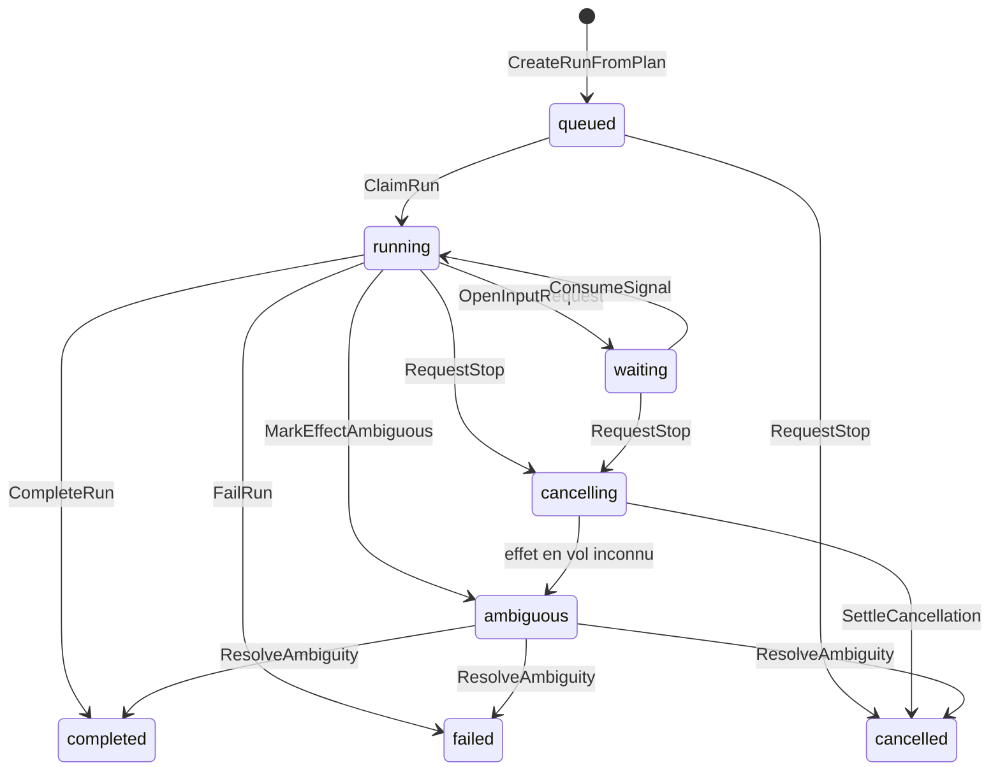
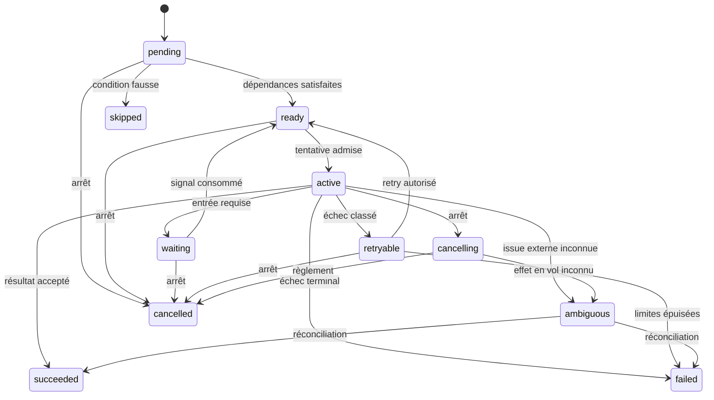

# Domaine et cycles de vie — cible V1

- Statut : **spécification de conception acceptée pour `DOMAIN-001` via RFC-0001 et ADR-0004**
- Date : **2026-07-21**
- Réalité actuelle : **le candidat V1 headless local implémente les lifecycles
  `Run`, `StepRun` et `Attempt`, le DAG durable, le routage et fallback Tavily
  vers Exa BYOK, le ledger, l'ambiguïté et le résultat durable ; la génération
  provider-neutral de datasets est une cible post-V1 acceptée par RFC-0008,
  sans aggregate, contrat public, migration ou endpoint implémenté**

## Objet

Ce document précise le domaine portable retenu pour `DOMAIN-001`. Il fixe le
sens de `Capability`, `WorkflowSpec`, `RunPlan`, `Run`, `StepRun`, des tentatives,
des coûts, des signaux humains, des artefacts et des délégations. Ce vocabulaire
doit rester indépendant de PostgreSQL, de l’orchestrateur, des providers et des
surfaces REST, SDK, CLI ou MCP.

Les noms et transitions ci-dessous forment la baseline acceptée par
[RFC-0001](../rfcs/0001-v1-module-contract-domain-baseline.md) et résumée dans
[ADR-0004](../adr/0004-v1-module-contract-domain-baseline.md). Leur
représentation publique devra provenir du catalogue JSON Schema canonique. Leur
persistance relèvera de ports et de repositories. Ce document ne remplace ni les
schémas contractuels, ni les migrations, ni les tests qui devront en apporter la
preuve.

## État de l'implémentation et écart restant

Le modèle courant est porté par le kernel et les adapters V1 uniquement :

- `packages/kernel` modélise `RunPlan`, `Run`, `StepRun`, `Attempt`, leurs
  versions et séquences monotones, le retry conservant l'historique, la
  redelivery prouvée et l'ambiguïté bloquée jusqu'à réconciliation ;
- `packages/application` porte la création, la lecture, le claim de run, le
  routage/claim et les transitions de tentative, le dispatch et la
  réconciliation sans I/O direct ;
- `packages/adapters/postgres` persiste plans, runs, événements, commandes,
  steps, tentatives, réservations, usages, outbox, snapshots et bindings
  d'orchestration avec isolation workspace ;
- `apps/api` et `apps/worker` sont les seules composition roots serveur.

Le schéma et le runtime du prototype ont été retirés. Le claim d'une tentative
écrit son événement, son outbox et son binding dans la même transaction. Un
dispatcher fenced démarre la task Hatchet `kurobara-step-attempt-v1`, et son
callback applique le seuil d'effet puis règle ou réconcilie l'issue via les
ports applicatifs. Le worker peut composer soit la fixture sans réseau
`deterministic-local`, soit les adapters BYOK Tavily et Exa derrière le bridge
provider-neutral maintenu par Kurobara. Le premier sert aux preuves déterministes ; les
seconds réalisent des effets réels bornés et ne changent pas les contrats du
domaine.

Un scheduler PostgreSQL matérialise chaque `StepRun ready` dont les dépendances
ont réussi. Une seconde queue durable choisit la première route du plan
immuable dont l'adapter est composé. L'application fige ordre, provenance,
quote et limites, puis persiste `RoutingDecision`, réservation, tentative,
événements, journal de commande, outbox et binding dans la transaction de
claim. Une erreur Tavily certaine et retryable peut ouvrir le fallback Exa
prévu avec la même `operation_key`; une issue ambiguë bloque toute nouvelle
dépense. Le résultat du sink est validé contre le `ContractRef` exact, puis un
artifact normalisé et son `ResultManifest` deviennent durables avant la
terminaison du run.

Roots, fan-out, fan-in, retry, fallback, annulation et réconciliation sont
prouvés localement. Restent hors qualification les signaux humains, la
délégation, le stockage objet, SSE, MCP et une topologie de production. La
génération de datasets sans CSV décrite par
[RFC-0008](../rfcs/0008-provider-neutral-dataset-generation.md) est également
absente du runtime courant : elle ne devient pas disponible par cette mise à
jour documentaire.

## Contextes bornés

| Contexte | Agrégats et objets principaux | Responsabilité | Ne décide pas |
| --- | --- | --- | --- |
| Catalogue | `Capability`, `WorkflowSpec` | Décrire ce qu’un workflow demande et valider son DAG typé | Quel provider sera appelé ou si un run peut dépenser |
| Planification | `RunPlan`, `RoutingDecision`, `CostQuote` | Figer entrée, versions, routes admissibles, quote et limites avant exécution | Exécuter un effet ou modifier un plan accepté |
| Exécution | `Run`, `StepRun`, `Attempt` | Accepter les commandes, faire respecter les transitions et converger vers un règlement | Réaliser directement une I/O |
| Autorité | `AuthorityEnvelope`, `Delegation` | Borner identité, workspace, capabilities, données, budget, temps et descendants | Accorder un droit absent de la chaîne parente |
| Économie | `Budget`, `CostReservation`, `UsageEntry` | Réserver, régler ou libérer une autorité consommable | Déduire un coût à partir d’un log provider |
| Interaction humaine | `InputRequest`, `HumanSignal` | Ouvrir une attente, recevoir, autoriser, dédupliquer, expirer et consommer un signal | Élargir l’autorité du run |
| Résultats | `Artifact`, `ResultManifest` | Décrire résultats, intégrité, provenance, sensibilité et rétention | Transformer un résultat partiel en succès implicite |
| Matérialisation de datasets | `DatasetImport` ; cible : `DatasetMaterialization`, `DatasetGeneration` | Construire un dataset immuable, porter son origine et sa readiness, coordonner les pages provider | Exécuter directement un effet ou exposer un curseur provider dans un record public |
| Journal métier | `RunEvent` | Porter les faits acceptés dans un ordre relisible | Devenir une seconde machine d’états divergente |

Les frontières servent à préserver les invariants. Elles n’imposent pas un
microservice par contexte : la V1 reste un monolithe modulaire, et une même
transaction applicative peut coordonner plusieurs repositories lorsque
l’invariant l’exige.

Dans le code courant, seule l'origine `DatasetImport` existe et la readiness est
encore déduite de son état. La cible acceptée par RFC-0008 ajoute une
matérialisation origin-neutral et un aggregate `DatasetGeneration` distinct.
Chaque page facturable doit alors passer par un Run canonique mono-step ; son
artifact durable est checkpointé avec records, curseur, lineage et références
de coût avant que le dataset ne devienne `ready`.

### Value objects transversaux

Les value objects sont immuables, comparables par valeur et validés à leur
construction. La cible comprend au minimum `WorkspaceRef`, `CapabilityRef`,
`ContractRef`, `ContentHash`, `AggregateVersion`, `IdempotencyKey`,
`OperationKey`, `MoneyOrUnits`, `BudgetLimit`, `Deadline`, `DurationLimit`,
`DataScope`, `ResourceScope`, `RetryPolicy`, `ResultCompleteness` et
`CorrelationRef`. Ils portent les règles de format, d’unité, de borne et de
compatibilité afin que ces règles ne soient pas réinterprétées dans chaque
adapter.

Une somme sans unité ou devise compatible, une deadline sans fuseau absolu, une
version flottante, un scope vide interprété comme universel ou un identifiant
mal formé est refusé à la construction. Les horodatages métier sont normalisés
en instants UTC ; leur représentation locale reste une responsabilité de
projection.

## Agrégats, entités et value objects

### `Capability`

Une capability nomme un résultat métier, pas un provider ni un endpoint. Sa
révision fixe les `ContractRef` d’entrée, de sortie et de problèmes, les classes de
données, les types d’effets possibles, les exigences d’autorité et les unités de
quote. Une référence de capability comprend son identifiant stable et sa version
exacte ; `latest` n’est jamais une valeur figée dans un plan.

Le kernel ne résout pas les schémas et n'en transporte pas les octets. Une
`ContractRef` est une valeur opaque comprenant version et fingerprint du
catalogue, `$id`, version et fingerprint du schéma. La validation JSON Schema,
la résolution et l'archivage appartiennent aux frontières contractuelles et aux
adapters.

### `WorkflowSpec`

`WorkflowSpec` est l’agrégat auteur d’un DAG déclaratif. Il contient des nœuds
typés par capability, leurs dépendances, les mappings d’entrées et de sorties,
les conditions autorisées, les points d’entrée humaine et les contraintes de
fan-out, profondeur et durée. Une révision publiée est immuable et possède un
hash de contenu.

Le compilateur refuse notamment un cycle, une référence non résolue, un mapping
incompatible, une capability absente de l'allowlist préautorisée fournie en
entrée, une limite absente ou une expansion supérieure aux bornes. Il vérifie ce
snapshot structurel sans lookup de policy ni décision d'accès propre. Un
`WorkflowSpec` valide n’est pas encore une autorisation d’exécuter.

### `RunPlan`

`RunPlan` est la photographie exécutable composée par la couche application pour
une entrée normalisée. Il référence le `CompiledWorkflow` pur, mais embarque
aussi les snapshots nécessaires
pour qu’une évolution du catalogue, d’une policy ou d’un adapter ne modifie pas
le sens d’un run accepté.

Avant l’entrée en `queued`, il fixe au minimum :

- l’entrée normalisée et son hash ;
- le DAG compilé, la version et le fingerprint du catalogue, ainsi que chaque
  `ContractRef` exacte ;
- la policy et les faits de routage utilisés ;
- les adapters admissibles et l’ordre de fallback autorisé ;
- la quote, son niveau de garantie, son unité, sa devise éventuelle et son
  expiration ;
- le budget, la deadline, les timeouts et la stratégie de retry ;
- l’enveloppe d’autorité, les gates humains et les limites de délégation ;
- les versions des composants déterministes et un hash de plan.

Une adaptation pendant l’exécution ajoute une nouvelle `RoutingDecision` dans
les bornes du plan. Elle ne mute ni le plan, ni une décision antérieure.

`plans.quote` prépare ce `RunPlan` et sa `CostQuote` sans créer de `Run` ni de
`run_id`. `runs.create` vérifie plan, quote, budget, deadline, autorité et
idempotency key, puis crée directement un `Run` en `queued` avec son premier
événement et son message d'outbox. La baseline V1 décide qu'une instance de
`RunPlan` est single-use et crée au plus un run logique. `WorkflowSpec` et
`CompiledWorkflow` restent réutilisables ; toute nouvelle exécution reçoit un
nouveau plan et de nouveaux snapshots par `plans.quote`.

La même idempotency key avec la même intention normalisée retourne le run et la
réponse initiale. La même clé avec une autre intention produit
`idempotency-key-reused`; une autre clé sur un plan consommé produit
`run-plan-already-consumed`. Plan, clé, `Run`, `RunQueued` et première outbox
deviennent visibles dans un seul commit ; un rollback ne consomme ni plan ni clé.

### `Run`

`Run` est la racine de cohérence du cycle global. Il possède l’identité du plan,
le workspace, l’état courant, la version d’agrégat, la séquence d’événements, les
conditions d’arrêt, le statut de résultat et les références de ses steps et
descendants. Il décide si une commande change l’état ; il ne lance pas lui-même
un worker ou un provider.

Un résultat possède une complétude orthogonale à l’état du run : `none`,
`partial` ou `complete`. Ainsi un run `failed`, `cancelled` ou `ambiguous` peut
conserver des résultats partiels. Un run `completed` ne peut exposer `partial`
que si le contrat de résultat du plan l’autorise explicitement comme résultat
acceptable.

### `StepRun` et `Attempt`

`StepRun` représente l’exécution logique d’un nœud du plan. Plusieurs
tentatives peuvent lui appartenir, mais une tentative ne remplace jamais la
précédente. Le step conserve ses dépendances, son entrée résolue, ses décisions
de routage, son attente humaine éventuelle, son résultat et son règlement.

`Attempt` représente une acquisition technique et, le cas échéant, un effet
externe. Il possède une identité, un numéro monotone, le motif de création, le
snapshot de route, l’`operation_key`, les timestamps observés et une issue. Une
redelivery de la même tentative ne crée ni nouvelle tentative, ni nouvelle
autorisation de dépense.

### Routage, quote, réservation et usage

`RoutingDecision` est immuable. Elle enregistre la version de policy, le snapshot
des faits, les candidats admis et rejetés avec leurs reason codes, le choix, les
fallbacks et les estimations.

`CostQuote` décrit une prévision `hard`, `estimated` ou `unknown`, son unité, sa
devise éventuelle, sa version de prix, sa borne supérieure lorsqu’elle existe et
son expiration. `CostReservation` bloque atomiquement une part du budget avant
un effet. `UsageEntry` règle l'usage observé avec une identité de mouvement
stable ; une libération sans usage reste identifiée par la réservation et la
preuve de commande durable. PostgreSQL `numeric` porte les mouvements du ledger
et l'application accepte les montants fractionnaires historiques tout en
vérifiant leur conservation sans comparaison d'addition IEEE-754 exacte. Une
quote n’est pas un mouvement de ledger.

### Entrées humaines

`InputRequest` décrit l’action attendue, son schéma, la qualité d’identité
requise, sa portée run/step, son expiration et une clé déterministe de
consommation. `HumanSignal` est un fait reçu : identité de l’auteur, payload,
idempotency key, moment de réception, décision d’autorisation et statut de
consommation.

Un signal arrivé avant la suspension peut être conservé dans l’inbox durable et
apparié à la demande correspondante. Un signal rejoué avec la même clé retourne
son résultat antérieur. Un signal expiré, mal scoped, non autorisé ou visant une
demande déjà consommée ne reprend pas l’exécution ; le refus reste auditable.

### Artefacts, événements, autorité et délégation

`Artifact` est une référence, jamais l’hypothèse que le contenu volumineux réside
dans l’agrégat. Elle porte type, schéma, hash d’intégrité, taille, classification,
provenance, état de finalisation, contrôle d’accès et politique de rétention.

`RunEvent` est un fait append-only avec identifiant, `run_id`, séquence monotone,
type, version de schéma, instant métier, acteur, correlation et causation IDs,
payload expurgé et références d’artefacts protégés.

Ce `RunEvent` est un fait interne, pas un payload public sérialisé directement.
Une projection de frontière peut partager son identité sémantique, mais un
adapter la mappe vers une `ContractRef` publique et valide cette représentation.
Le kernel et l'application n'importent ni type ni validateur généré depuis
`packages/contracts`.

L’`AuthorityEnvelope` et la `Delegation` suivent le
[modèle d’autorité agentique](./agent-authority.md). Une délégation acceptée crée
un sous-run normal, lié à son parent, avec une enveloppe réduite, un sous-budget
réservé et un contrat de résultat. Elle ne crée pas un chemin privilégié autour
des policies, du ledger ou des transitions.

## Identités, versions et snapshots

Les identifiants sont opaques, stables et scoped par workspace lorsque l’objet
est tenanté. Ils ne codent ni ordre temporel fiable, ni provider, ni secret.

| Objet | Identité et version minimales |
| --- | --- |
| Capability | `capability_id`, `capability_version`, `ContractRef` exactes |
| Workflow | `workflow_spec_id`, révision, hash de contenu |
| Plan | `run_plan_id`, `catalog_version`, `catalog_fingerprint`, `ContractRef` exactes et hash du plan |
| Run | `run_id`, `workspace_id`, version d’agrégat |
| Step | `step_run_id`, `run_id`, clé de nœud du plan |
| Tentative | `attempt_id`, `step_run_id`, numéro monotone |
| Effet | `operation_key`, stable avant tout envoi |
| Décision | `routing_decision_id`, version de policy et hash des faits |
| Économie | `quote_id`, `reservation_id`, `usage_entry_id`, version de prix |
| Humain | `input_request_id`, `signal_id`, idempotency key |
| Artefact | `artifact_id`, `ContractRef` exacte du payload structuré lorsqu'elle existe, hash d’intégrité |
| Événement | `event_id`, `run_id`, séquence, type interne et `ContractRef` de projection publique lorsqu'elle existe |
| Autorité | `authority_envelope_id`, version, `delegation_id` et parent |

L'adapter lie une commande publique à l'`operation_version` et aux `ContractRef`
exactes du registre ; le client fournit une idempotency key lorsqu'elle est
requise, pas une « version de contrat » générique. Une commande interne fournit
en plus la version d’agrégat attendue. Un conflit de
version est rejeté ou réévalué à partir du nouvel état ; il n’est pas écrasé par
un dernier écrivain silencieux.

## Vocabulaire des commandes et événements

Les commandes expriment une intention et peuvent être refusées. Les événements
expriment uniquement un fait déjà accepté.

| Commande de domaine | Événement principal en cas d’acceptation |
| --- | --- |
| `CreateRunFromPlan` | `RunQueued` ; la commande crée l'agrégat au lieu de transitionner un run préexistant |
| `ClaimRun` | `RunStarted` |
| `OpenInputRequest` | `InputRequested`, puis `RunWaiting` uniquement si aucune branche indépendante ne peut progresser |
| `SubmitHumanSignal` | `HumanSignalAccepted` ou événement de refus auditable, sans transition globale implicite |
| `ConsumeSignal` | `InputRequestConsumed`, puis `RunResumed` si la consommation rouvre une progression globale |
| `RequestStop` | `RunStopRequested`, puis `RunCancelling` ou `RunCancelled` |
| `SettleCancellation` | `RunCancelled` après règlement des travaux en vol |
| `CompleteRun` | `RunCompleted` |
| `FailRun` | `RunFailed` |
| `MarkEffectAmbiguous` | `ExternalEffectBecameAmbiguous`, puis `RunAmbiguous` si l’issue globale ne peut être déterminée |
| `ResolveAmbiguity` | `AmbiguityResolved`, puis événement terminal choisi |
| `ExpireQuote` | `QuoteExpired` dans le contexte de planification ; aucun `Run` n'existe encore |
| `ScheduleStep` | `StepReady` |
| `ClaimStepAttempt` | `AttemptCreated` puis `AttemptClaimed` |
| `RecordRoutingDecision` | `RoutingDecisionRecorded` |
| `ReserveCost` | `CostReserved` |
| `SettleUsage` | `UsageSettled` ou `CostReservationReleased` |
| `DelegateRun` | `DelegationAccepted` puis `ChildRunQueued` |
| `AcceptChildResult` | `ChildResultAccepted` |

Une notification d’outbox, un heartbeat d’orchestrateur ou une livraison SSE
n’est pas un événement métier supplémentaire. Ces mécanismes transportent ou
projettent un fait existant.

## Machine d’états du run

### Sens des états

| État | Sens et autorisations |
| --- | --- |
| `queued` | Plan, snapshots, autorité, budget et deadline ont été validés et figés ; l’outbox peut demander l’orchestration. |
| `running` | Au moins une progression est autorisée ; chaque step et effet conserve ses propres préconditions. |
| `waiting` | Le run attend une entrée durable et aucune branche indépendante immédiatement exécutable ne reste ; aucune action dépendante du signal ne part. Tant qu’une autre branche progresse, le run global reste `running` et seul son `StepRun` est `waiting`. |
| `cancelling` | Une condition d’arrêt est observée ; aucun nouveau step, enfant, coût ou effet n’est autorisé, et les travaux en vol doivent être réglés. |
| `ambiguous` | Une issue externe empêche de déterminer le règlement global ; toute nouvelle dépense est bloquée jusqu’à réconciliation. |
| `completed` | Le contrat de résultat est satisfait, tous les effets sont réglés et tous les descendants requis sont conclus. |
| `failed` | Le run ne peut plus satisfaire son contrat ; les coûts et résultats partiels restent visibles. |
| `cancelled` | L’arrêt a convergé et les effets en vol sont réglés ou explicitement résolus ; le motif distingue demande humaine, deadline, budget ou arrêt d’un ancêtre. |

### Matrice exhaustive `état × commande`

La création depuis un plan valide précède cette matrice : il n'existe aucun run
en état `quoted`. La matrice couvre toutes les commandes qui peuvent modifier
l’état global d'un run existant. `—` signifie refus avec problème typé et sans
événement de transition. `=` signifie réponse idempotente uniquement pour la
redelivery de la même commande et de la même idempotency key. `↺` signifie que
la commande est acceptée et ajoute un fait, mais que l'état global ne change pas.

| État courant | `ClaimRun` | `OpenInputRequest` | `ConsumeSignal` | `RequestStop` | `CompleteRun` | `FailRun` | `MarkEffectAmbiguous` | `SettleCancellation` | `Resolve→completed` | `Resolve→failed` | `Resolve→cancelled` |
| --- | --- | --- | --- | --- | --- | --- | --- | --- | --- | --- | --- |
| `queued` | `running` | — | — | `cancelled` | — | — | — | — | — | — | — |
| `running` | = | `waiting` ou ↺ | — | `cancelling` | `completed` | `failed` | `ambiguous` | — | — | — | — |
| `waiting` | — | — | `running` ou ↺ | `cancelling` | — | — | — | — | — | — | — |
| `cancelling` | — | — | — | = | — | — | `ambiguous` | `cancelled` | — | — | — |
| `ambiguous` | — | — | — | ↺ | — | — | = | — | `completed` | `failed` | `cancelled` |
| `completed` | — | — | — | — | = | — | — | — | = | — | — |
| `failed` | — | — | — | — | — | = | — | — | — | = | — |
| `cancelled` | — | — | — | = | — | — | — | = | — | — | = |

Les préconditions restent obligatoires même lorsqu’une cellule indique une
transition. `CreateRunFromPlan` refuse une quote expirée, une version inconnue,
un hash de plan incohérent, une autorité insuffisante, une deadline passée, un
budget non réservable ou un plan déjà consommé par une autre création.
`OpenInputRequest` ne place le run en `waiting` que si aucune branche
indépendante ne peut progresser ; `ConsumeSignal` ne le remet en `running` que
si une progression globale redevient possible. `CompleteRun` refuse un step requis non réglé, un descendant
requis ouvert, une réservation pendante, un effet ambigu ou un résultat non
conforme. `ResolveAmbiguity` exige une preuve de réconciliation et une issue
compatible avec les faits observés.

Une deadline dépassée, un budget épuisé, une révocation ou l’arrêt d’un parent
sont normalisés en `RequestStop`. Depuis `queued`, l’arrêt est terminal sans
travail en vol. Depuis `running` ou `waiting`, il passe par `cancelling`. Depuis
`ambiguous`, il enregistre le règlement terminal souhaité mais ne masque pas
l’ambiguïté : seule sa résolution peut conclure le run.

## Cycle de vie de `StepRun` et d’`Attempt`

### États de `StepRun`

Les états terminaux sont `succeeded`, `failed`, `cancelled` et `skipped`.
`ambiguous` n’est pas terminal. Un step requis `failed` fait échouer le run sauf
si le contrat du plan définit explicitement un résultat partiel acceptable ou
un fallback encore autorisé. Un step optionnel `skipped` ne peut pas être
présenté comme exécuté.

### États d’une tentative

Une tentative suit `prepared → claimed → in_flight`, puis exactement une issue
parmi `succeeded`, `failed_retryable`, `failed_terminal`, `ambiguous` ou
`cancelled_before_effect`. Une demande d’arrêt pendant `in_flight` ne permet pas
de déclarer `cancelled_before_effect` : l’issue doit être observée ou devenir
`ambiguous`.

`prepared` signifie que route, autorité, opération et réservation ont été
validées. `claimed` signifie qu’un worker possède un lease technique, jamais un
droit métier supplémentaire. `in_flight` commence au seuil de l’effet externe.
La perte d’un lease ne change pas à elle seule l’issue de la tentative.

Sur la révision actuelle, chaque commande fraîche postérieure au claim cible
aussi l'`attempt_id` exact et la version d'agrégat attendue. Un callback retardé
ne peut donc pas régler la tentative suivante. Un replay durable, reconnu avant
ce fence devenu obsolète, reste lié à l'acteur et n'applique aucune nouvelle
transition. Le seuil `StartAttemptEffect` retourne une permission d'effet
uniquement lors de sa première acceptation ; son replay retourne `replay-only`
et impose lookup ou réconciliation, jamais un second appel aveugle.

La décision et le claim acceptés publient `RoutingDecisionRecorded`, puis les
événements de création et de claim de tentative. Ils ajoutent aussi un message
interne `orchestration.step.attempt.claimed` et un binding propre à
l'`attempt_id` dans le même commit PostgreSQL. La route et l'adapter d'effet
sont dérivés du plan immuable, portés jusqu'à l'outbox et revalidés par le
worker : celui-ci ne peut pas leur substituer un adapter. La start key stable
vaut `effect:<attempt_id>`. Le
dispatcher persiste `starting` avant Hatchet, ne réessaie pas un résultat
inconnu sans lookup exact, et transforme une lease expirée en
`reconciliation_required`. Un rejet certain avant le seuil produit
`RecordAttemptNotStarted`, libère la réservation exacte et conclut la tentative
sans `effectStartedAt`. Un reconciler périodique d'effet rappelle le même use
case depuis l'identité persistée sans resoumettre Hatchet. Cette mécanique
qualifie le protocole de leaf task et son routage local ; elle ne qualifie pas
encore un provider externe ou un fallback adaptatif.

Le même réveil durable du scheduler DAG porte aussi la convergence globale
fail-closed. Après un step requis `failed`, chaque descendant bloqué reçoit un
`StepRun skipped` et un `StepSkipped` explicites, sans tentative ni coût. Le run
ne devient `failed` que lorsque tous les nœuds du plan sont ainsi couverts,
toutes les tentatives matérialisées sont terminales, chaque réservation est
réglée ou libérée et le coût réservé vaut zéro. Le `ResultManifest` d'échec,
`RunResultManifestRecorded`, `RunFailed`, le snapshot du run, la preuve de
commande et la consommation du job partagent alors le même commit.
Cette convergence reste autorisée après la deadline : l'échéance interdit tout
nouveau `StepRun ready` et toute nouvelle tentative, mais elle ne peut pas
empêcher la propagation sans effet des `skipped` ni le règlement d'un échec
déjà prouvé.

À l'inverse, une suite de `StepRun succeeded` ne prouve pas le contrat de sortie.
Tant qu'aucun output normalisé, référencé et validé contre l'`outputContract`
n'est durable, le scheduler enregistre `result-proof-missing`, ne crée aucun
manifest et laisse honnêtement le `Run` en `running`.

Le chemin heureux local V1 accepte comme output global la sortie du seul nœud
terminal du DAG. L'application, pas le kernel, résout la `ContractRef` exacte et
valide la valeur normalisée avant de créer une référence d'`Artifact` finalisée.
Cette référence, son contenu JSON borné et le règlement de la tentative
partagent le même commit PostgreSQL. Une violation certaine du contrat conclut
la tentative en échec avec son coût réel ; une panne du validateur ou du
stockage ne réautorise jamais l'effet externe. Après couverture réussie et coût
entièrement réglé, l'`Artifact`, le `ResultManifest`, `CompleteRun`,
`RunResultManifestRecorded`, `RunCompleted` et la consommation du job sont liés
transactionnellement. Un workflow sans nœud terminal unique reste fermé avec
`output-binding-ambiguous` : aucune agrégation implicite n'est inventée tant que
les mappings de sortie du workflow ne sont pas modélisés.

## Retry, redelivery, replay et resume

- **Redelivery** : nouvelle livraison technique de la même commande, outbox ou
  tentative. Elle réutilise identités et idempotency keys et ne crée aucun fait
  métier déjà accepté.
- **Retry** : nouvelle tentative du même `StepRun`, créée uniquement après une
  erreur classée retryable, dans les limites du plan, de l’autorité, du budget et
  de la deadline. Elle ajoute un `Attempt`; elle ne réécrit pas l’historique.
- **Fallback** : nouvelle décision de routage autorisée par le plan. Il peut
  conduire à une tentative différente, mais ne constitue pas un élargissement
  de capability ou d’autorité.
- **Replay** : réduction déterministe des événements déjà acceptés pour
  reconstruire agrégat ou read model. Il ne lit ni horloge, ni réseau, ne réserve
  aucun coût et ne publie aucun effet.
- **Resume** : continuation après attente, arrêt technique ou réconciliation. Il
  repart du dernier état durable ; il ne remet pas le run à zéro et ne crée une
  tentative que si la policy l’autorise explicitement.

Une tentative `ambiguous` n’est jamais retryable avant réconciliation. Si le
provider accepte une idempotency key, sa réutilisation réduit le risque sans
transformer l’issue inconnue en échec certain.

La limite `maxAttemptsPerStep` est figée dans le plan. Une issue encore classée
retryable est normalisée en échec terminal lorsque cette limite est atteinte ou
que la deadline ne permet plus une nouvelle tentative. Un état transitoire du
run comme `waiting` refuse l'autorisation sans terminaliser le step. Pour un
ancien état déjà `retryable`, `AuthorizeRetry` produit `StepRetryExhausted` et fait
passer le step à `failed` au lieu de le laisser bloqué, même après expiration de
la deadline. Les plans et policies antérieurs projettent la valeur conservative
`1` au parsing sans mutation de leur JSON, de leur hash ou de leur version.

La conclusion d'une tentative porte un receipt structuré lié à la tentative,
la réservation, l'`operation_key`, l'unité et, lorsqu'un usage existe, son
entrée de ledger. Un simple booléen applicatif ne constitue pas une preuve de
règlement. PostgreSQL règle ou libère la réservation, met à jour le coût du run,
la tentative normalisée, le snapshot de step, les événements et le journal de
commande dans la même transaction.

## Annulation, deadline, budget et effets en vol

Les conditions d’arrêt sont évaluées avant chaque création de step, délégation,
réservation, claim métier et envoi externe. La limite la plus restrictive de la
chaîne d’autorité prévaut.

1. une annulation ou une deadline ferme immédiatement les nouvelles
   autorisations ;
2. l’échec d’une réservation pour budget insuffisant ne déclenche aucun effet ;
3. l’arrêt se propage à tous les sous-runs et steps non terminaux ;
4. un travail sans effet peut être abandonné coopérativement ;
5. un effet déjà envoyé est observé, réglé ou marqué ambigu ;
6. les dépenses engagées, usages et résultats partiels ne sont pas effacés ;
7. le run ne devient `cancelled` qu’après règlement des travaux en vol.

Un budget `hard` n’est admissible que si chaque effet facturable possède une
borne exécutable. Une quote `estimated` ou `unknown` ne doit pas être transformée
en garantie stricte par le domaine.

## Ambiguïté et réconciliation

L’ambiguïté appartient d’abord à l’opération et à sa tentative. Elle remonte au
`StepRun`, puis au `Run` lorsque aucune conclusion globale honnête n’est possible.
Elle conserve `operation_key`, route, réservation, requête expurgée, accusés
connus et références d’artefacts.

Le reconciler propose un fait parmi : effet confirmé avec usage, absence d’effet
confirmée avec libération, effet échoué confirmé, ou issue toujours inconnue. Le
domaine valide que la preuve vise la bonne opération et que le règlement n’a pas
déjà eu lieu. Tant que l’issue reste inconnue, aucune tentative payante de la
même opération et aucune conclusion terminale incompatible ne sont admises.

Une compensation est une nouvelle opération avec sa propre autorité, sa propre
réservation et son propre cycle d’ambiguïté. Elle ne supprime pas l’événement
original.

## Résultats partiels et artefacts

Chaque résultat de step est normalisé par l'adapter vers une valeur interne.
Lorsqu'un step est l'unique sortie globale du workflow, l'application vérifie
sa valeur contre la `ContractRef` exacte du plan avant de la référencer. Les
contrats propres aux sorties intermédiaires et leur agrégation restent à
modéliser ; ils ne sont jamais remplacés par l'`outputContract` global. La
projection publique est ensuite mappée et validée à la frontière contractuelle ;
le domaine ne résout pas lui-même JSON Schema. Le `ResultManifest` distingue :

- les sorties complètes et acceptées ;
- les sorties partielles prévues par le contrat ;
- les artefacts de diagnostic ou de provenance non assimilables à un résultat ;
- les données manquantes et leur reason code ;
- l’intégrité, la sensibilité et la rétention de chaque référence.

L’annulation et l’échec n’effacent rien de déjà acquis. En revanche, un payload
invalide, un artefact non finalisé ou un résultat d’enfant hors contrat ne peut
pas satisfaire la complétude du parent.

## Signaux humains précoces, rejoués et expirés

La clé d’une demande d’entrée est déterministe pour le run, le step et le point
du plan. La frontière applicative persiste d’abord le signal autorisé, puis
publie sa disponibilité. Le worker relit l’inbox avant de s’endormir.

- **Précoce** : si la demande correspondante est déjà déterminable, le signal
  reste `pending` puis est consommé à l’ouverture ; sinon il est refusé comme
  non corrélable, sans deviner sa destination.
- **Rejoué** : la même idempotency key et le même payload retournent la décision
  initiale ; une clé réutilisée avec un payload différent produit un conflit.
- **Expiré** : le signal ou la demande dépassant sa fenêtre reste historique mais
  n’ouvre aucune transition.
- **Concurrent** : une seule réponse autorisée gagne la consommation ; les
  suivantes voient `already_consumed`.
- **Révoqué** : une identité révoquée avant la consommation ne peut pas franchir
  le gate si la policy exige une autorisation encore active à cet instant.

La consommation produit `RunResumed` uniquement lorsque toutes les
préconditions du point d’attente sont satisfaites. Une approbation ne modifie ni
le budget, ni les capabilities, ni les portées de données.

## Parent, enfants et multi-agent

Une délégation est acceptée dans la transaction qui vérifie l’enveloppe parent,
réserve le sous-budget et enregistre la relation. Le sous-run reçoit son propre
`run_id`, son plan, ses steps, événements et résultat, ainsi que `parent_run_id`,
`root_run_id`, `delegation_id` et la chaîne d’autorité.

Les règles suivantes sont obligatoires :

1. l’autorité enfant est une réduction monotone de l’autorité parent ;
2. son budget réservé réduit immédiatement le disponible du parent ;
3. sa deadline ne dépasse pas celle du parent ;
4. profondeur, fan-out, concurrence et tours consomment les limites de la chaîne ;
5. l’arrêt parent interdit immédiatement les nouveaux effets enfants et se
   propage à leurs descendants ;
6. le parent n’accepte qu’un résultat conforme au contrat de délégation ;
7. un enfant requis non terminal empêche la terminaison du parent ;
8. un enfant ambigu empêche un règlement parent incompatible ;
9. le coût enfant est consolidé une seule fois dans le ledger racine ;
10. la reprise d’un parent ne recrée pas un enfant possédant le même
    `delegation_id`.

La V1 ne détache pas silencieusement un enfant. Si un futur mode autonome doit
survivre à la terminaison du parent, il nécessitera une autorité racine distincte
et une décision d’architecture explicite.

## Invariants inter-agrégats

1. **Plan figé** : aucun run ne devient `queued` sans snapshots, versions, hash,
   quote, budget, deadline et autorité valides.
2. **Transition fermée** : tout changement d’état correspond à une cellule
   admise de la matrice et à un événement versionné.
3. **Concurrence maîtrisée** : la version d’agrégat empêche deux commandes
   concurrentes d’accepter des transitions incompatibles.
4. **Effet identifié** : aucune I/O externe ne commence sans `operation_key`
   durable, tentative, décision de route et autorité.
5. **Budget conservé** : `spent + reserved <= budget` reste vrai pour le run
   racine et chaque sous-run.
6. **Règlement unique** : une réservation est réglée ou libérée au plus une fois.
7. **Historique append-only** : retry, fallback, resume et réconciliation ajoutent
   des faits ; ils ne réécrivent pas les décisions antérieures.
8. **Résultat honnête** : complétude, partialité et ambiguïté ne sont jamais
   converties implicitement en succès.
9. **Signal unique** : une demande d’entrée consomme au plus une décision valide,
   sauf multiplicité explicitement déclarée dans le plan.
10. **Autorité conservée** : aucun enfant, step ou outil n’obtient un droit absent
    de sa chaîne.
11. **Descendants réglés** : un parent terminal a comptabilisé tous les enfants
    requis et n’en laisse aucun capable d’engager un effet.
12. **Artefact intègre** : un résultat ne référence comme finalisé qu’un artefact
    dont l’identité, le hash et la portée d’accès sont établis.

## Frontières applicatives transactionnelles et outbox

Cette section définit l'orchestration attendue de la couche application, pas une
implémentation SQL ni une responsabilité du kernel. Le kernel reçoit une
commande et retourne décisions ou événements ; l'application possède l'unité de
travail et l'adapter PostgreSQL l'implémente.

Une commande est traitée avec la séquence logique suivante :

1. charger les agrégats et leurs versions attendues ;
2. valider contrat, identité, workspace, autorité et préconditions ;
3. produire la nouvelle version d’état et les événements métier ;
4. appliquer dans la même unité atomique les réservations nécessaires à
   l’invariant ;
5. ajouter les messages d’outbox dérivés des événements ;
6. valider par compare-and-set ;
7. seulement après commit, livrer l’outbox à l’orchestrateur ou à un adapter.

L’interface d’outbox porte une identité stable, le type et la version du message,
workspace, aggregate ID/version, event ID, causation/correlation IDs, destination
logique, disponibilité et payload expurgé. Sa remise est au moins une fois. Le
consommateur déduplique sur l’identité métier, pas seulement sur une fenêtre du
transport.

Les unités atomiques minimales sont :

- acceptation du plan + `RunQueued` + première outbox ;
- création de tentative + claim d’opération + réservation + outbox d’exécution ;
- signal accepté + inbox durable + outbox de réveil ;
- délégation + sous-budget + relation parent/enfant + outbox enfant ;
- règlement d’usage + issue de tentative + événements associés ;
- transition terminale + manifest de résultat + événement final.

Un appel réseau, un upload objet ou une publication à l’orchestrateur ne se
produit jamais dans la transaction métier. Une coordination entre agrégats qui
ne partage pas un invariant immédiat progresse par événements idempotents et
réconciliation, sous la responsabilité de la couche application.

## Replay déterministe et read models

La réduction d’un événement accepte uniquement l’état précédent et l’événement
versionné. Horloge, génération d’ID, résultat provider, policy, prix et
autorisation sont injectés dans la commande puis enregistrés comme faits ou
snapshots avant le replay.

Une séquence strictement croissante par run donne un ordre local. Les causation
et correlation IDs relient les agrégats sans inventer un ordre total global.
Une version d’événement inconnue arrête le replay avec une erreur explicite ; un
upcaster versionné peut produire une vue compatible sans modifier l’événement
historique.

Les read models — statut de console, timeline SSE, coût, arbre de délégation ou
résultats — sont des projections jetables et reconstruisibles. Leur retard ne
change pas l’état métier. Une relecture ne déclenche jamais outbox, provider,
réservation, signal ou télémétrie métier supplémentaire.

Cette exigence n’impose pas un event sourcing intégral : une ligne d’agrégat
versionnée peut accélérer les commandes, à condition que le journal et les
snapshots permettent de vérifier les transitions et de reconstruire les
projections promises.

## Scénarios d’acceptation testables

Ces scénarios qualifient la future implémentation. Leur présence dans cette
spécification n’est pas une preuve de réussite actuelle.

| Scénario | Résultat attendu |
| --- | --- |
| Créer un run depuis un plan sans version de capability, hash de workflow ou policy | `CreateRunFromPlan` refusé ; aucun run `queued`, événement ou outbox d’exécution. |
| Créer un run depuis une quote expirée | Aucun `Run` ni `run_id` n'est créé ; `QuoteExpired` reste un fait du contexte de planification. |
| Envoyer chaque commande depuis chaque état du run | Seules les cellules admises de la matrice changent l’état ; toutes les autres retournent un problème stable. |
| Deux workers réclament le même run avec la même version | Un seul `ClaimRun` gagne ; la redelivery retourne l’état sans second `RunStarted`. |
| Retry après erreur retryable | Un nouvel `Attempt` monotone est ajouté au même `StepRun`; l’ancienne tentative reste inchangée. |
| Redelivery de la même outbox d’effet | Même tentative, même `operation_key`, même réservation ; aucun second droit de dépense. |
| Replay complet d’un historique | Même état, même complétude et mêmes read models, sans I/O ni nouvel événement. |
| Signal reçu avant le wait puis redélivré | Le signal corrélé est persisté, consommé une fois et le replay ne crée pas une seconde reprise. |
| Signal expiré ou auteur non autorisé | Aucun `RunResumed`; refus auditable et état `waiting` conservé. |
| Deux signaux valides concurrents visent une demande unique | Une consommation gagne ; l’autre obtient `already_consumed`. |
| Deadline pendant un appel externe sans accusé | Plus aucun effet ne démarre ; la tentative et le run deviennent ambigus jusqu’à réconciliation. |
| Annulation d’un run en file | Passage direct `queued → cancelled`, sans claim de step ni coût. |
| Annulation d’un run actif avec résultat partiel | Passage par `cancelling`; résultat partiel et coût engagé restent accessibles après règlement. |
| Deux réservations concurrentes épuisent le budget | Au plus les réservations compatibles avec `spent + reserved <= budget` sont acceptées. |
| Réconciliation confirme un effet facturé après crash | Usage réglé une fois, tentative conclue et run résolu selon son contrat. |
| Tentative ambiguë relancée avant réconciliation | Retry refusé, même si le transport ou le provider annonce une idempotency key. |
| Enfant demande plus de budget ou une deadline plus tardive | Délégation refusée atomiquement, sans sous-run actif ni réservation orpheline. |
| Parent annulé avec enfants actifs | Nouvelles autorisations enfants fermées ; tous convergent avant le règlement terminal du parent. |
| Enfant renvoie un résultat hors contrat | Résultat rejeté ; le parent ne devient pas `completed`. |
| Step optionnel produit une sortie partielle autorisée | Manifest marqué `partial`; succès global seulement si le contrat du plan l’admet. |
| Artefact uploadé mais non finalisé lors d’un crash | Il n’est pas exposé comme résultat final ; la réconciliation le finalise ou le classe orphelin. |
| Projection SSE supprimée puis reconstruite | Même séquence observable depuis les événements, sans changement de l’état métier. |

## Conditions de preuve pour clore `DOMAIN-001`

Cette spécification ne clôt pas le ticket. La preuve exige encore :

- les schémas canoniques versionnés des commandes, états, événements, problèmes
  et résultats ;
- un kernel sans I/O qui implémente la matrice et les invariants ;
- des tests de table couvrant chaque cellule admise et refusée ;
- des tests par propriétés sur versions, budgets, tentatives, délégations et
  idempotence ;
- des fixtures de replay déterministe et d’upcast ;
- des ports de persistence, horloge, IDs, outbox et orchestration sans import
  d’adapter dans le domaine ;
- la preuve que les projections REST, SDK, CLI et MCP partagent ces mêmes
  significations.

## Références publiques

- [Architecture cible V1 OSS agentique](./v1-oss-agentic.md)
- [Modèle d'autorité agentique](./agent-authority.md)
- [Frontières de modules acceptées](./module-boundaries.md)
- [Système de contrats accepté](./contract-system.md)
- [ADR-0002 — Socle d’exécution durable](../adr/0002-durable-agentic-runtime.md)
- [ADR-0003 — Contrats canoniques et protocoles d’intégration](../adr/0003-contracts-and-agent-protocols.md)
- [ADR-0004 — Baseline modules, contrats et domaine](../adr/0004-v1-module-contract-domain-baseline.md)
- [Processus RFC](../rfcs/README.md)
- [Roadmap publique](../../ROADMAP.md)
- [RFC-0001 — Baseline modules, contrats et domaine](../rfcs/0001-v1-module-contract-domain-baseline.md)
