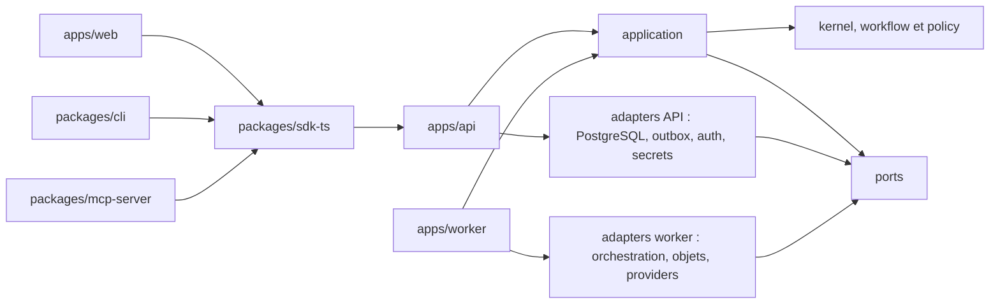
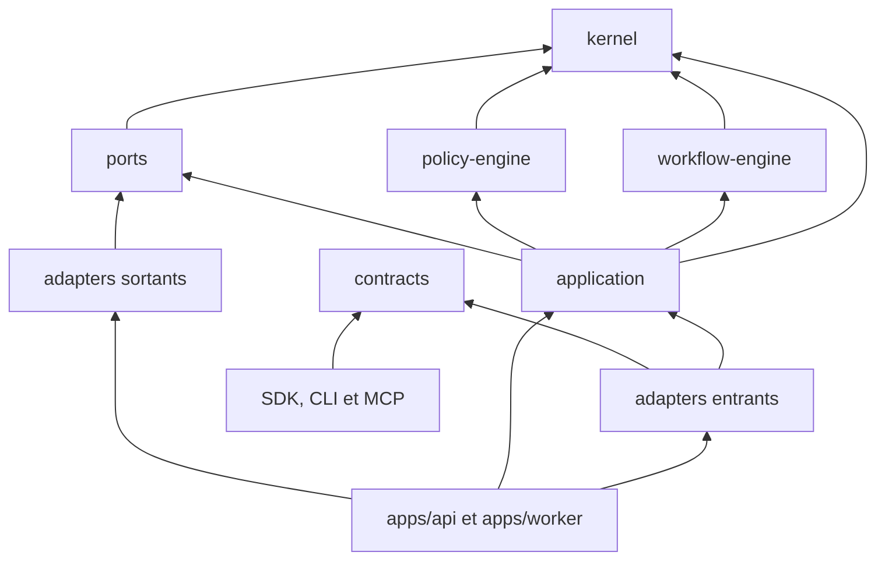

# Frontières du monolithe modulaire — cible V1

- Statut : **spécification de conception acceptée pour `ARCH-001` via RFC-0001 et ADR-0004**
- Date : **2026-07-17**
- Dernière mise à jour : **2026-07-20**
- Réalité actuelle : **candidat V1 headless local ; API, worker durable,
  PostgreSQL, Hatchet, routage/fallback Tavily -> Exa BYOK, annulation durable,
  export direct et conformité plugin locale sont implémentés ; signal humain,
  SSE, export durable, sandbox tierce et production ne sont pas qualifiés**

## Objet

Cette spécification transforme les principes de l'architecture V1 en frontières
de modules vérifiables. Elle fixe la direction des dépendances, la propriété des
transactions et des effets, les composition roots et les seams de test attendus
pour le monolithe modulaire Kurobara.

Elle approfondit les décisions existantes sans les remplacer : PostgreSQL reste
la vérité métier, Hatchet OSS reste derrière un port d'orchestration, les
contrats publics partent de JSON Schema et le service managé ne peut dépendre que
du cœur public. Un changement de ces décisions ou d'une frontière publique suit
le [processus RFC](../rfcs/README.md). Les détails ci-dessous ont été acceptés
par [RFC-0001](../rfcs/0001-v1-module-contract-domain-baseline.md) et résumés
dans [ADR-0004](../adr/0004-v1-module-contract-domain-baseline.md).

## Réalité du dépôt sur la révision actuelle

Le graphe exécutable ne contient plus le prototype historique. La révision
courante expose uniquement la fondation V1 :

- `apps/api` compose l'adapter HTTP, l'application, PostgreSQL et un lifecycle
  de processus borné ;
- `apps/worker` compose l'executor Hatchet, les dispatchers d'outbox run et
  tentative, le callback d'effet, les reconcilers PostgreSQL et les schedulers
  de routage et de DAG, avec démarrage, supervision et arrêt sûrs ;
- `packages/kernel`, `workflow-engine`, `policy-engine`, `ports` et
  `application` sont des workspaces séparés avec exports explicites ;
- `packages/contracts` ne contient plus le contrat d'enrichissement historique :
  la racine et le subpath `./v1` exposent la même projection générée depuis le
  catalogue JSON Schema canonique ;
- `packages/plugin-sdk` expose les huit méthodes provider-neutral et valide les
  manifests, messages et frames canoniques ; `packages/adapters/provider-example`
  dépend uniquement de ce SDK ;
- `packages/adapters/provider-registry`, `provider-search-common`,
  `provider-tavily`, `provider-exa` et `effect-plugin` composent les routes
  BYOK maintenues par Kurobara et leur bridge d'effet sans faire remonter un SDK provider
  dans le domaine ;
- `packages/plugin-host` dépend du SDK et du parseur JSON strict épinglé, puis
  exécute le profil sidecar local dans un processus distinct par appel ; il
  n'est composé dans aucun serveur ;
- `packages/plugin-conformance` dépend seulement des surfaces publiques de
  `contracts`, `plugin-sdk` et `plugin-host`, plus Ajv ; il produit un rapport
  déterministe pour un profil local exact et n'est composé dans aucun runtime ;
- `packages/sdk-ts` et `packages/cli` projettent `datasets.import`,
  `recipes.apply`, le snapshot `recipe-applications.get` et le stream
  `recipe-applications.export`, ainsi que `runs.cancel`, vers l'API locale sans
  accès direct aux use cases ou à PostgreSQL ;
- `packages/adapters/postgres` porte les migrations, l'unité de travail, les
  snapshots de planification, l'outbox et les bindings de réconciliation ;
- `packages/adapters/orchestration-hatchet` et le fake déterministe implémentent
  le même port sans faire entrer les types Hatchet dans le domaine ;
- `packages/adapters/output-json-schema` implémente le port générique de
  validation d'output avec Ajv 8.20 en mode strict ; le worker enregistre à son
  composition root le schéma local déterministe et vérifie sa référence exacte
  contre le manifest de contrats généré ;
- `dependency-cruiser`, le contrôle AST des imports calculés et vingt tests
  positifs ou négatifs couvrent uniquement les workspaces réellement présents ;
- le site, le Worker Cloudflare, l'ancien stockage et les packages UI ont été
  retirés ; un SDK HTTP et une CLI minimaux ont été reconstruits pour
  l'import, l'apply, le watch, l'export direct d'application et l'annulation,
  tandis que MCP reste absent.

La création et la lecture de runs, la planification, l'authentification locale,
les outboxes run/tentative, la leaf task et leurs chemins de réconciliation sont
démontrés. Le scheduler DAG matérialise automatiquement les roots puis les
branches de fan-out/fan-in dont toutes les dépendances ont réussi. Le scheduler
de routage choisit ensuite la première route immuable compatible avec les
adapters effectivement composés, puis persiste décision, réservation, claim,
événements, outbox et binding dans une transaction. Une route temporairement
indisponible est retentée avec backoff ; l'absence permanente de route échoue
fermée. Pour la capability du vertical, un échec Tavily certain et retryable
autorise une nouvelle décision vers Exa avec la même `operation_key`; une issue
ambiguë interdit le fallback. Le gate live relit tentatives, décisions, seuils
d'effet et règlements exacts dans PostgreSQL. Le mode fixture conserve un
output JSON déterministe à coût nul. L'application ne retient que l'output du
sink unique du DAG, le valide contre le `ContractRef` exact du plan, puis persiste
dans PostgreSQL un artifact normalisé immuable de 64 Kio maximum et son
`ResultManifest` avant de terminer le run. Un output absent, non enregistré ou
non conforme échoue fermé ; aucun payload n'est inventé. Tavily et Exa sont des
providers BYOK réels composés localement ; stockage objet, signal humain,
serveur MCP et console restent absents. Le SDK et la CLI appellent l'API locale
pour importer un dataset, appliquer une recette, observer son snapshot et
télécharger sa projection exacte ; ils ne remplacent ni le worker ni
l'orchestration. Le harness Hatchet reste une fixture de qualification locale,
pas une topologie de production.

L'export direct illustre la propriété des frontières : `application` sélectionne
et prévalide la projection métier via les ports, l'adapter HTTP mappe le contrat
et transmet les octets avec backpressure, le SDK expose un iterable lazy
one-shot et la CLI publie un fichier privé sans overwrite. Aucun client ne
recalcule la sélection métier ou ne lit PostgreSQL. Cette route ne passe pas par
un `ObjectStoragePort` et ne persiste ni artifact, ni `export_id`, ni politique
de rétention ; ce lifecycle reste la cible distincte d'`ARTIFACT-001` et
`API-002`.

Cette tranche prouve le candidat headless et ses invariants de reprise
localement ; elle ne constitue ni une release self-host publique, ni une
qualification de production. Les sections cibles restent normatives pour les
éléments absents.

## Carte cible des processus

La distribution V1 contient trois processus serveur Kurobara et deux
composition roots clientes. Chaque processus possède un unique point
d'assemblage où les implémentations concrètes sont choisies.

| Composition root cible | Responsabilité | Dépendances concrètes permises au root | Interdit |
| --- | --- | --- | --- |
| `apps/web` | Documentation et console self-host | framework Web, UI, SDK HTTP, configuration de présentation | importer DB, orchestrateur, providers ou exécuter un use case métier en parallèle de l'API |
| `apps/api` | Authentifier, autoriser, exécuter les commandes courtes, servir les lectures et SSE | adapter HTTP, application, auth, PostgreSQL, outbox, secrets et télémétrie | conserver du travail long en mémoire ou appeler directement un provider |
| `apps/worker` | Dispatcher l'outbox, piloter les tâches durables, exécuter les effets et réconcilier | application, PostgreSQL, orchestrateur, stockage objet, secrets, télémétrie et adapters providers | exposer une seconde API publique ou définir une règle métier propre au worker |
| `packages/cli` | Composer configuration locale, SDK HTTP, rendu humain et sortie structurée | SDK, contrats générés et bibliothèque CLI | importer application, DB, orchestrateur ou provider |
| `packages/mcp-server` | Composer transport MCP local, SDK HTTP et projections de tools | SDK, contrats générés et SDK MCP | importer application, DB, orchestrateur, provider ou accepter une annotation MCP comme autorisation |

CLI et MCP sont des composition roots parce qu'ils choisissent endpoint,
credentials, transport et rendu. Ils restent néanmoins des clients : ils
traversent l'API via le SDK et n'ouvrent jamais un chemin in-process vers le
command bus.



Les flèches représentent une dépendance de build autorisée. Aucun nœud en aval
ne peut importer un composition root.

## Carte cible des packages

### Noyau pur

`packages/kernel` porte les entités, value objects, transitions, erreurs et
invariants métier. Il ne connaît ni schéma public sérialisé, ni framework, ni
base, ni orchestrateur, ni provider. Ses fonctions reçoivent toutes les données
nécessaires en arguments et retournent des décisions ou événements métier sans
effectuer d'I/O.

Le kernel ne dépend d'aucun autre workspace Kurobara. Les primitives de langage
et bibliothèques sans I/O ne peuvent y entrer qu'après justification de leur
déterminisme et de leur utilité métier.

### Compilateur de workflow

`packages/workflow-engine` dépend uniquement du kernel. Il convertit une
spécification interne déjà validée en DAG typé, vérifie structure, profondeur,
fan-out, cycles, limites et gates, puis produit un `CompiledWorkflow`
déterministe. Il ne lit
ni registry, ni horloge, ni configuration, ni état de santé : l'application lui
fournit un snapshot complet.

Le `CompiledWorkflow` ne contient ni route provider, ni quote, ni budget, ni
autorité. La couche application compose ensuite le `RunPlan` immuable à partir
de ce DAG, des décisions du policy engine et des snapshots économiques et
d'autorité. Le compilateur ne possède donc jamais le `RunPlan` complet.

Un planner, y compris un planner LLM optionnel, ne réside pas dans le
compilateur. Il propose une entrée hostile qui doit franchir validation,
autorisation, compilation et quote avant de pouvoir produire un run.

### Moteur de policy

`packages/policy-engine` dépend uniquement du kernel. Il évalue des faits et une
policy versionnés pour retourner une décision et des reason codes. Il ne
découvre pas lui-même les adapters, ne consulte pas leur santé et n'appelle pas
un modèle : registry, mesures et prédictions arrivent sous forme de snapshots.

La même combinaison `policy + facts + versions` doit produire la même décision.
La collecte des faits et la persistence de la trace appartiennent à
l'application et aux ports.

### Ports

`packages/ports` définit les interfaces dont les use cases ont besoin :
repositories, unité de travail, outbox, orchestration, horloge, identifiants,
authentification, secrets, stockage objet, télémétrie et adapters de capability.
Il peut employer les types du kernel, mais ne dépend d'aucune implémentation.

Un port décrit une capacité attendue par le produit, pas l'API d'un fournisseur.
Ses erreurs et garanties sont exprimées dans le vocabulaire Kurobara. Les types
Hatchet, Drizzle, S3, HTTP ou SDK provider restent dans leur adapter.

### Couche application

`packages/application` dépend de `kernel`, `workflow-engine`, `policy-engine` et
`ports`. Elle contient les use cases, le command bus interne, les policies
d'autorisation applicatives et la coordination des transactions. Elle obtient
des données par les ports, appelle les moteurs purs puis persiste les décisions.

Elle ne dépend d'aucune application, d'aucun framework de transport, d'aucun
adapter concret et d'aucun SDK fournisseur. Elle ne retourne pas un objet HTTP,
MCP ou CLI. Ses commandes et résultats internes sont mappés aux contrats publics
par les adapters entrants.

La cible acceptée de
[RFC-0008](../rfcs/0008-provider-neutral-dataset-generation.md) place aussi le
contrôleur de `DatasetGeneration` dans cette couche. Il coordonne query figée,
readiness, pages et Runs canoniques par des ports provider-neutral. Le port de
lecture des datasets devient commun aux origines ; les ports de mutation
`DatasetImport` et `DatasetGeneration` restent séparés. Le contrôleur ne réalise
ni appel provider, ni transaction SQL, ni orchestration directe et ne crée pas
un second runtime d'effets. Cette frontière est une décision non implémentée sur
la révision actuelle.

### Contrats publics

`packages/contracts` contient le catalogue JSON Schema canonique, ses fixtures
et ses projections générées, y compris le descripteur de sortie streamée de
`recipe-applications.export`. Il ne dépend ni du kernel ni de
l'application : un contrat public est une frontière de sérialisation versionnée,
pas le modèle objet interne.

Les adapters entrants valident un payload public avant de le mapper vers une
commande applicative. À la sortie, ils mappent le résultat interne vers le
contrat public puis le valident. Cette duplication contrôlée de représentation
évite que des choix HTTP, MCP ou de compatibilité contaminent le domaine ; elle
ne permet pas de redéfinir séparément la sémantique métier.

### Extension plugin locale

`packages/plugin-sdk` dépend uniquement de `contracts` et d'Ajv. Il porte la
frontière fonctionnelle provider-neutral et ses validations sans importer le
kernel, les ports, l'application, les adapters ou les composition roots.

`packages/adapters/provider-example`, `provider-tavily` et `provider-exa`
dépendent de la racine publique du SDK, directement ou via le commun de
normalisation admis. `effect-plugin` adapte leur protocole au port d'effet et le
registre fournit au composition root des descriptors sans secret.
`packages/plugin-host` ajoute au SDK le parseur JSON strict
`jsonc-parser@3.3.1`, puis porte le transport process-per-call du mode
développeur non fiable. Le provider exemple reste une fixture fonctionnelle sans
I/O ; Tavily et Exa sont au contraire des routes explicites maintenues par le
worker. Le host ne transforme ni l'admission du manifest en permission réseau,
ni son processus enfant en sandbox.

`packages/plugin-conformance` peut importer les exports publics de `contracts`,
`plugin-sdk` et `plugin-host`, Ajv et les primitives Node nécessaires au harness.
Il valide et sérialise le rapport canonique, sélectionne une combinaison exacte
de la matrice et exerce le host local. Il ne peut pas importer kernel, ports,
application, adapters concrets ou composition roots. Le template extérieur
reste sous `templates/plugin-adapter` et n'ajoute aucune route au worker.

### Adapters entrants

Les adapters entrants traduisent un transport vers l'application : HTTP dans
`apps/api`, puis les projections clientes dans SDK, CLI et MCP. Ils possèdent la
validation de frontière, le mapping de transport, les limites de taille et la
présentation des erreurs, mais aucune règle métier.

Un adapter entrant peut dépendre de `contracts` et `application`. Il ne peut pas
importer un adapter sortant. Seul le composition root reçoit à la fois les
adapters entrants et sortants pour les assembler.

### Adapters sortants

Les adapters sortants implémentent les ports : PostgreSQL, Hatchet, stockage
compatible S3, secrets, télémétrie et providers. Chaque package d'adapter dépend
de `ports` et, si nécessaire pour implémenter une signature, de `kernel`. Un
adapter provider peut aussi consommer les contrats publics du manifest de
plugin ; il ne peut pas importer l'application ou un autre provider.

Les adapters normalisent les erreurs externes et rendent explicites timeout,
retry sûr, effet ambigu, coût et provenance. Ils ne décident pas seuls si un
fallback, une compensation ou une dépense supplémentaire est autorisé.

## Matrice des imports retenue

La matrice ci-dessous est exhaustive pour les dépendances entre couches cibles.
Une cellule absente de la colonne « peut importer » vaut interdiction.

| Source | Peut importer | Ne peut notamment pas importer |
| --- | --- | --- |
| `kernel` | aucun workspace Kurobara | contrats, application, moteurs, ports, adapters, apps, frameworks ou SDK externes à effets |
| `workflow-engine` | `kernel` | policy engine, ports, contrats, application, adapters, apps |
| `policy-engine` | `kernel` | workflow engine, ports, contrats, application, adapters, apps |
| `ports` | `kernel` | contrats, application, moteurs, adapters, apps |
| `application` | `kernel`, `workflow-engine`, `policy-engine`, `ports` | contrats publics, adapters concrets, apps, HTTP, MCP, CLI, Hatchet, Drizzle ou SDK provider |
| `contracts` | aucun workspace métier | kernel, moteurs, ports, application, adapters, apps |
| adapter entrant HTTP | `contracts`, `application`, types du kernel strictement nécessaires au mapping | adapter sortant, SDK client, CLI, MCP ou autre composition root |
| adapter sortant | `ports`, types du `kernel` nécessaires, `contracts` uniquement pour un contrat public d'extension | application, adapter entrant, app ou autre adapter sortant |
| `plugin-sdk` | `contracts` | kernel, moteurs, ports, application, adapters et apps |
| `plugin-host` | `plugin-sdk`, parseur JSON strict épinglé | contrats directs, kernel, moteurs, ports, application, autres adapters et apps |
| `plugin-conformance` | `contracts`, `plugin-sdk`, `plugin-host`, Ajv et primitives Node du harness | kernel, moteurs, ports, application, adapters et apps |
| provider exemple | `plugin-sdk` | contrats directs, kernel, moteurs, ports, application, autres adapters et apps |
| `sdk-ts` | `contracts` | kernel, application, ports, DB, orchestrateur ou provider |
| `cli` et `mcp-server` | `sdk-ts`, `contracts`, bibliothèques propres au transport | kernel, application, ports, adapters serveur ou apps |
| `ui` et `design-tokens` | packages de présentation autorisés entre eux | kernel, application, ports, DB, orchestrateur ou provider |
| `apps/web` | UI, design tokens, SDK, configuration Web | application in-process, ports et adapters sortants |
| `apps/api` | adapter HTTP, application et adapters concrets requis pour le câblage | autre app, CLI, MCP ou logique provider hors adapter |
| `apps/worker` | application, contrats canoniques et adapters concrets requis pour le câblage | autre app, UI, SDK client ou surface publique parallèle |

Règles transversales :

1. aucun package n'importe un fichier interne d'un autre workspace ; seuls ses
   exports publics sont autorisés ;
2. un package métier n'importe jamais `apps/*` ;
3. les composition roots sont des feuilles du graphe : rien ne dépend d'elles ;
4. aucun barrel global ne réexporte toutes les couches et ne contourne la
   matrice ;
5. une dépendance de type reste une dépendance d'architecture et suit les mêmes
   règles ;
6. l'injection dynamique, les alias de chemin et la génération de code ne
   peuvent pas contourner une interdiction ;
7. un accès réseau, disque, environnement, horloge système ou générateur
   aléatoire est une I/O et passe par un port hors des moteurs purs.



## Composition et configuration

Un composition root peut connaître les deux côtés d'un port uniquement pour
construire le graphe d'objets. Il :

- lit et valide la configuration au démarrage ;
- construit clients, pools et adapters ;
- enregistre les implementations dans une registry explicite ;
- injecte les ports dans les use cases ;
- configure shutdown, healthchecks et télémétrie ;
- refuse le démarrage si une dépendance requise est absente ou incompatible.

Il ne contient ni transition métier, ni décision de routage, ni requête SQL
ad hoc. La configuration validée est transformée en valeurs typées avant
d'entrer dans l'application. Aucun package profond ne lit directement
`process.env` ou un binding de plateforme.

## Propriété des transactions et des I/O

### Transaction métier

Le use case applicatif possède la frontière transactionnelle. Il demande une
unité de travail au port de persistence et exécute dans cette unité les lectures,
les décisions pures et les écritures qui doivent rester atomiques. L'adapter
PostgreSQL fournit le mécanisme ; il ne choisit pas le périmètre métier.

La création d'un run, son événement initial et son message d'outbox partagent
ainsi une transaction. Les repositories participent à l'unité de travail reçue
et n'ouvrent pas de transaction imbriquée invisible.

### Effet externe

Aucun appel réseau fournisseur n'est exécuté dans une transaction SQL longue.
Le worker suit trois phases explicites :

1. transaction courte pour vérifier l'autorité, réclamer l'opération, réserver
   le budget et persister l'identité d'effet ;
2. appel externe par l'adapter après commit ;
3. nouvelle transaction courte pour régler, libérer ou marquer l'effet ambigu,
   persister provenance et publier la suite par outbox.

Un vrai retry réutilise l'`operation_key`, mais ajoute un nouvel `attempt_id` et
un numéro de tentative monotone. Une redelivery technique de la même tentative
réutilise au contraire le même `attempt_id`. L'orchestrateur transporte et
reprend du travail, mais il n'accorde jamais une deuxième autorisation métier.
La coordination inter-processus passe par l'état durable et l'outbox, pas par la
mémoire d'une app.

Les autres unités atomiques structurantes suivent la même propriété
applicative : signal humain accepté + inbox durable + outbox de réveil, ainsi
que délégation + réservation du sous-budget + relation parent/enfant + outbox du
sous-run. Aucune notification n'est publiée avant le commit correspondant.

### Moteurs purs

Kernel, compilateur et policy engine ne possèdent aucune transaction et aucune
I/O. Horloge, identifiants, santé, prix, quotas et disponibilité sont capturés
par l'application via des ports, versionnés si nécessaire, puis fournis comme
valeurs. Une décision passée peut ainsi être relue sans rappeler un système
externe.

## Propagation du workspace, de l'acteur et de l'autorité

Chaque commande applicative mutable reçoit un contexte explicite contenant au
minimum :

- l'identité de l'acteur authentifié et son mode d'authentification ;
- le `workspace_id` dans lequel la commande est évaluée ;
- la commande ou capability demandée ;
- une corrélation de requête et une identité d'idempotence lorsqu'elle est
  requise ;
- l'enveloppe d'autorité applicable aux runs et délégations agentiques.

L'adapter entrant authentifie le credential brut et construit une proposition
de contexte. L'application vérifie ensuite l'appartenance au workspace, la
permission, la policy et les limites métier avant tout effet. Le simple fait
d'atteindre une route, un tool MCP ou un worker ne constitue pas une
autorisation.

Les repositories et les ports à effet exigent un scope explicite ; ils ne
déduisent pas le workspace d'une variable globale. Les identifiants de ressource
seuls ne suffisent pas à lever l'isolation. Le worker recharge depuis PostgreSQL
le snapshot d'acteur, de workspace et d'autorité attaché au plan ; il n'hérite
pas silencieusement de l'identité technique du processus.

Une délégation dérive une enveloppe plus restrictive selon le
[modèle d'autorité agentique](./agent-authority.md). Cette réduction est vérifiée
avant la création du sous-run puis avant chaque effet sensible. Annulation,
deadline, budget et révocation ferment les nouvelles autorisations pour toute la
descendance, même si l'arrêt technique de l'orchestrateur est différé.

## Frontière du service managé

Le dépôt du service managé peut importer des releases publiques et implémenter
des ports d'entitlements, metering, secrets ou provisioning. Le monorepo public
ne peut importer :

- aucun package, schéma ou type privé ;
- aucun endpoint managé requis pour démarrer ou exécuter le parcours self-host ;
- aucune valeur, feature flag ou credential propre à l'opérateur ;
- aucun test dont les fixtures ou services ne sont pas publiquement
  reproductibles.

Les implémentations locales nécessaires au parcours documenté vivent dans le
produit public. Une extension managée est branchée au composition root du dépôt
privé par les mêmes ports versionnés qu'une extension d'opérateur. Cette règle
est celle de l'[ADR-0001](../adr/0001-open-source-product-boundary.md) et ne peut
être inversée par une commodité de build.

## Seams de test et fakes

Chaque frontière cible possède une preuve proportionnée :

| Surface | Test attendu |
| --- | --- |
| Kernel | tests unitaires sans réseau, DB, variables d'environnement ou framework ; horloge et IDs sont des valeurs fournies |
| Workflow engine | fixtures de DAG valides et invalides, cycles, limites, gates et déterminisme du plan |
| Policy engine | tables de décision et property tests sur snapshots figés, reason codes et stabilité |
| Application | tests de use cases avec ports fakes en mémoire, unité de travail observable et journal d'appels explicite |
| Ports | suites de contrat réutilisées par chaque fake et adapter réel |
| PostgreSQL | tests d'intégration des transactions, contraintes, isolation workspace, outbox et concurrence |
| Orchestration | fake déterministe pour l'application puis tests d'intégration et de reprise contre Hatchet épinglé |
| Validation d'output | suites génériques sur le `ContractRef` exact, schéma strict, payload hostile et version du validateur ; composition testée contre le manifest généré |
| Providers | harness de conformité, serveur synthétique et scénarios timeout, retry, ambiguïté, coût et redaction |
| Contrats | fixtures validées, génération reproductible et tests de parité REST, SDK, CLI et MCP |
| Composition roots | smoke tests de configuration, healthcheck, shutdown et démarrage sans service managé |

Un fake implémente la même suite de contrat que l'adapter qu'il remplace. Il ne
doit pas rendre possible une opération interdite en production ni masquer
transaction, concurrence ou résultat ambigu. Les tests du kernel et des moteurs
purs doivent pouvoir s'exécuter sans installer les dépendances d'infrastructure.

## Enforcement retenu — état actuel et preuves restantes

Les contrôles suivants restent les critères complets. Leur présence dans cette
liste ne signifie pas que chacun est déjà branché à une CI publique :

1. déclarer les workspaces cibles avec des `exports` explicites et sans chemin
   interne public ;
2. encoder la matrice d'imports par défaut interdit dans `dependency-cruiser`
   18.x avec `tsPreCompilationDeps: "specify"` et un tsconfig d'analyse dédié ;
3. exécuter ce contrôle localement et dans le check requis de CI ;
4. détecter cycles, deep imports, dépendances non déclarées et imports
   infrastructure dans les couches pures ;
5. générer depuis le même crawl un graphe Mermaid collapsé au niveau workspace,
   le versionner puis refuser son drift en CI ;
6. ajouter des tests négatifs qui introduisent volontairement un import Hatchet,
   une dépendance runtime externe dans le kernel et vérifient la présence de la
   règle d'interdiction ;
7. vérifier qu'un clone public construit, teste et exécute le parcours self-host
   sans accès au dépôt ou au service managé ;
8. analyser tout source généré consommé par le build sans exception de couche ;
9. refuser par un contrôle AST TypeScript les `import()` et `require` dont le
   spécificateur n'est pas littéral ; un chargement variable passe par un
   registre explicite de fonctions à import littéral dans un composition root ;
10. rendre tout assouplissement de frontière visible dans le diff et soumis au
    processus RFC lorsqu'il change la décision normative.

Les liens npm workspaces et les `exports` des packages définissent les subpaths
publics. Un alias TypeScript ne peut pas les contourner et aucun import relatif
ne traverse un workspace. `node_modules`, outputs de build et caches peuvent
être exclus du crawl ; un fichier généré importé par le produit ne le peut pas.

`dependency-cruiser` est le mécanisme de preuve retenu, pas la frontière elle-même.
Il peut être remplacé sans nouveau RFC si le remplacement conserve la matrice
par défaut interdit, imports de types et dynamiques, fermeture des exports,
generated sources, tests négatifs et graphe reviewable.

Les tranches locales qualifiées couvrent les points 1, 2, 4, 5, 8, 9 et 10 ;
le point 6 couvre la règle runtime du kernel, les imports de type interdits et
les spécificateurs dynamiques calculés. Le check CI du point 3, les autres
familles d'infrastructure du point 6 et le clone self-host du point 7 restent
ouverts. La révision courante étend cette preuve locale à dix-sept checks, dont
les frontières positives et négatives du SDK, du host et de l'adapter exemple.
La commande `npm run architecture:drift` vérifie le crawl, les tests et le drift
du graphe dans un worktree propre ; son existence ne crée pas à elle seule un
check requis sur GitHub.

## Arbre cible illustratif

Cet arbre montre la destination logique. Il n'est ni un manifest livré, ni une
liste de fichiers réservée, ni une preuve que les packages existent.

```text
apps/
  web/                         # docs et console via SDK HTTP
  api/                         # composition root API
  worker/                      # composition root exécution durable
packages/
  kernel/                      # domaine pur
  workflow-engine/             # compilation pure des workflows
  policy-engine/               # décisions pures et reason codes
  ports/                       # interfaces sortantes
  application/                 # use cases et transactions
  contracts/                   # JSON Schema et projections générées
  adapters/
    http/                      # frontière entrante de l'API
    postgres/                  # repositories, UoW et outbox
    orchestration-hatchet/     # implémentation d'OrchestrationPort
    output-json-schema/        # validation stricte du ContractRef et de l'output
    object-storage-s3/         # implémentation d'ObjectStoragePort
    providers/                 # adapters maintenus par Kurobara
  sdk-ts/                      # client HTTP public
  cli/                         # composition root cliente
  mcp-server/                  # composition root cliente MCP
  design-tokens/               # présentation
  ui/                          # composants visuels
```

Les adapters peuvent être des workspaces séparés plutôt qu'un workspace à
sous-chemins si les règles de build et de publication l'exigent. Ce choix
d'empaquetage ne peut pas changer la direction des imports.

## État de la migration

Le prototype exécutable a été supprimé du graphe courant. Les registres de
publication peuvent encore citer ses anciens chemins comme preuve historique ;
ces citations ne désignent aucun module disponible.

Toute nouvelle console ou surface MCP, ainsi que toute extension du SDK ou de
la CLI au-delà d'import/apply, doit être construite depuis les contrats
canoniques et traverser l'API V1. Aucun ancien fichier applicatif n'est une base
de copy-forward. `MIG-001` reste ouvert jusqu'à la production et au contrôle du
manifest clean-room final.

## Invariants d'architecture

1. **Pureté du domaine** : kernel, workflow engine et policy engine n'effectuent
   aucune I/O et ne connaissent aucune infrastructure.
2. **Dépendances vers l'intérieur** : une couche métier ne dépend jamais d'un
   adapter ou d'un composition root.
3. **Use case unique** : REST, SDK, CLI et MCP n'introduisent aucune logique
   métier parallèle.
4. **Transaction explicite** : l'application choisit la transaction métier ;
   PostgreSQL l'exécute sans en redéfinir le périmètre.
5. **Effet réclamé avant envoi** : chaque effet externe est autorisé, identifié
   et réservé durablement avant l'appel.
6. **Contexte sans ambiance** : workspace, acteur et autorité sont propagés
   explicitement, jamais déduits d'un global implicite.
7. **Orchestrateur remplaçable** : aucun type ou identifiant Hatchet n'entre dans
   le domaine ou les contrats publics.
8. **Contrat indépendant** : le modèle interne ne devient pas une seconde source
   publique et le contrat public ne devient pas le domaine.
9. **Self-host autonome** : le cœur public ne requiert aucun package, endpoint,
   secret ou build du service managé.
10. **Frontière prouvée** : une règle d'import documentée n'est satisfaite
    qu'après contrôle automatisé et test négatif reproductible.

## Scénarios d'acceptation testables

Ces scénarios qualifient l'implémentation complète de `ARCH-001`. Sur la
révision de travail courante, les scénarios kernel sans infrastructure,
dépendance runtime, contournement par import de type ou dynamique, déterminisme
workflow/policy, rollback atomique, isolation workspace et drift du graphe sont
couverts localement. Les scénarios de publication et de production restent
ouverts.

| Scénario | Résultat attendu |
| --- | --- |
| Un test du kernel est lancé dans un environnement sans DB, réseau, Hatchet ni variables applicatives | Le package compile et tous ses tests passent uniquement avec des données en mémoire. |
| Un développeur importe Drizzle, Hono, Hatchet ou un SDK provider depuis le kernel | Le contrôle d'architecture échoue avec la frontière et l'import fautif. |
| Un import de type, dynamique ou via alias contourne la matrice | Le même contrôle le détecte et bloque le check. |
| Le workflow engine reçoit le même spec et le même snapshot deux fois | Il produit le même `CompiledWorkflow` ou la même erreur structurée sans I/O. |
| Le policy engine reçoit les mêmes faits et la même version de policy | Il produit la même décision et les mêmes reason codes. |
| REST, SDK, CLI et MCP déclenchent une même commande | Les quatre chemins atteignent le même use case via l'API et observent les mêmes identifiants, état et problème canonique. |
| Un provider est ajouté | Seuls son adapter, sa composition et ses preuves de conformité changent ; le kernel et les surfaces publiques ne sont pas modifiés. |
| Une création de run échoue avant le commit | Ni run, ni événement initial, ni message d'outbox ne devient visible. |
| Le worker tombe après l'appel externe mais avant son règlement | La reprise retrouve l'identité d'opération et converge vers règlement ou ambiguïté sans nouvelle autorisation automatique. |
| Une commande vise une ressource d'un autre workspace | L'application et l'adapter de persistence refusent l'accès sans fuite de données. |
| Un sous-run demande plus d'autorité que son parent | La réduction monotone échoue avant la création active ou l'effet. |
| Le SDK Hatchet est remplacé par un fake conforme | Les tests applicatifs ne changent ni leurs commandes ni leur modèle d'état. |
| Le dépôt public est construit sans accès au service managé | Build, tests et parcours self-host documenté n'effectuent aucun import ou appel requis vers le privé. |
| Le graphe de dépendances réel diverge du graphe autorisé | Le check d'architecture échoue et produit un diagnostic exploitable. |

`ARCH-001` ne peut être clos sur ce document seul. La clôture exige au minimum
les packages cibles nécessaires, leurs tests en mémoire, les règles d'import
automatisées, un graphe généré ou vérifié et les composition roots `api` et
`worker` exécutables selon le backlog.

## Références publiques

- [Architecture cible V1 OSS agentique](./v1-oss-agentic.md)
- [Modèle d'autorité agentique](./agent-authority.md)
- [Système de contrats accepté](./contract-system.md)
- [Domaine et cycles de vie acceptés](./domain-lifecycle.md)
- [ADR-0001 — Frontière entre produit OSS et service managé](../adr/0001-open-source-product-boundary.md)
- [ADR-0002 — Socle d'exécution durable](../adr/0002-durable-agentic-runtime.md)
- [ADR-0003 — Contrats canoniques et protocoles d'intégration](../adr/0003-contracts-and-agent-protocols.md)
- [ADR-0004 — Baseline modules, contrats et domaine](../adr/0004-v1-module-contract-domain-baseline.md)
- [Roadmap publique](../../ROADMAP.md)
- [RFC-0001 — Baseline modules, contrats et domaine](../rfcs/0001-v1-module-contract-domain-baseline.md)
- [dependency-cruiser — règles et graphes de dépendances](https://github.com/sverweij/dependency-cruiser)
