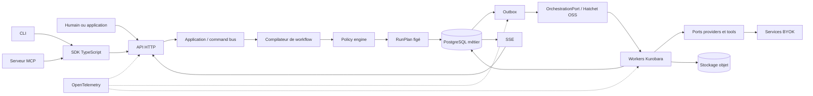
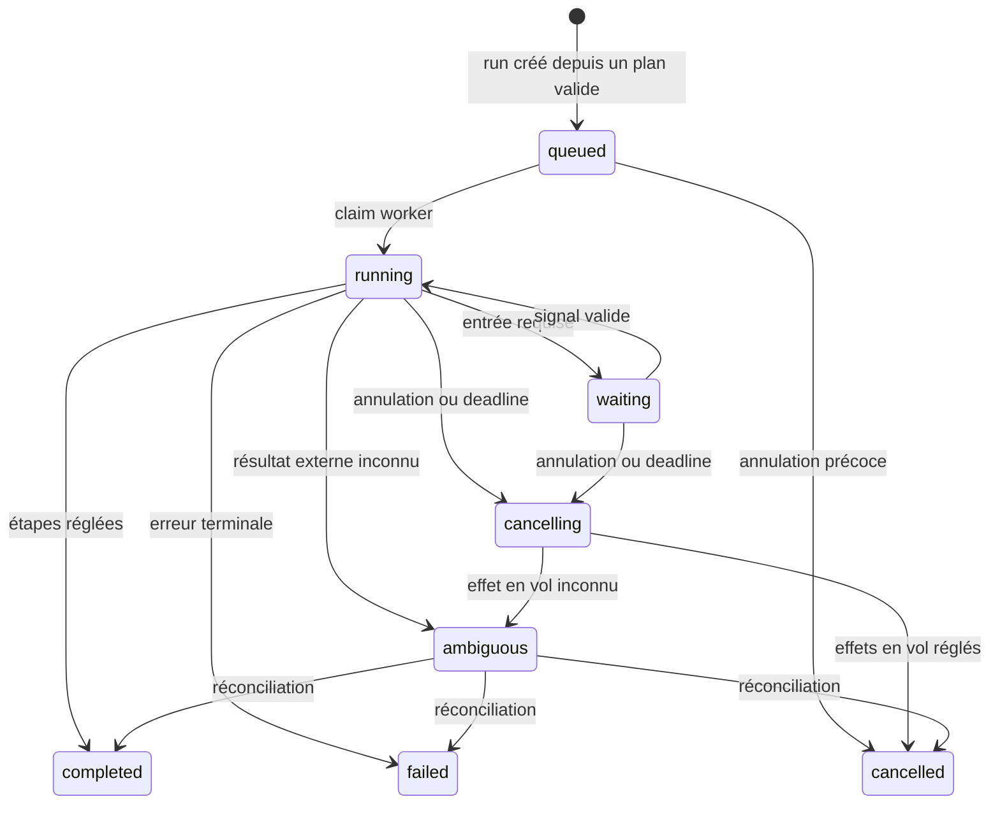

# Architecture cible — V1 OSS agentique

- Statut : **décision de conception**
- Date : **2026-07-17**
- Réalité actuelle : **source preview V1 OSS headless ; le vertical dataset,
  les routes BYOK company, contact et website ainsi que le fallback durable sont
  implémentés, mais ce document ne vaut ni release stable ni qualification de
  production**

## 1. Contrat de la V1

Kurobara V1 est un moteur open source qui transforme une intention structurée en
un plan explicable, chiffre ce plan, l'exécute durablement et retourne des
résultats traçables. La gate headless exige une API HTTP et une CLI partageant
les mêmes use cases. Le SDK TypeScript reste leur client commun ; MCP est une
projection P1 dérivée après preuve du parcours API/CLI.

Le profil produit prioritaire est dataset-first : des `Record` structurés sont
importés dans un `Dataset`, une `EnrichmentRecipe` versionnée cible un `Field`,
le workflow existant produit un `Run` durable et chaque sortie est projetée en
`CellResult`. Le [premier vertical headless](../development/headless-enrichment-slice.md)
décrit le candidat local et sépare explicitement l'export direct et les routes
Tavily/Exa désormais exposés du lifecycle d'artifact durable encore prévu.

La source preview est qualifiée lorsqu'un clone neuf permet, sans compte Kurobara Cloud,
de réaliser le parcours suivant :

1. démarrer la stack de référence ;
2. importer un dataset fixture JSONL ou CSV ;
3. appliquer une recette versionnée à un champ ;
4. enregistrer en BYOK deux adapters offrant une même capability ;
5. découvrir les capabilities, valider le workflow et obtenir une quote sans
   déclencher d'appel payant ;
6. créer un run idempotent avec budget, deadline et policy figés ;
7. observer une décision de routage puis un fallback motivé ;
8. reprendre sans recalculer les cellules déjà valides ;
9. obtenir puis exporter valeurs, statuts, provenance, fraîcheur, confiance et
   coût ;
10. reproduire ce parcours via API et CLI avec les mêmes identifiants et les
    mêmes erreurs, sans UI, cloud ou LLM obligatoire.

La qualification locale du 20 juillet 2026 démontre ce parcours par des profils
fixture et live rejoués depuis un clone frais propre, y compris le readback
PostgreSQL du fallback Tavily -> Exa. Codex a aussi piloté la fixture sans
interaction. Claude Code reste une compatibilité optionnelle non qualifiée ;
les artifacts publics de la source preview et la décision owner sont qualifiés.
Les droits d'usage provider restent une responsabilité BYOK de l'opérateur.

## 2. Principes non négociables

1. Le **kernel** ignore les frameworks, fournisseurs, bases et protocoles.
2. PostgreSQL est le registre métier ; l'orchestrateur est un mécanisme interne.
3. Chaque commande, événement, erreur et résultat public possède un schéma
   versionné.
4. Toute surface d'entrée traverse les mêmes use cases et policies.
5. Un run exécute un plan immuable ; l'adaptation produit une nouvelle décision
   persistée, jamais une mutation invisible.
6. Les effets externes sont au moins une fois et protégés au niveau métier.
7. Un modèle peut proposer ; seuls les validateurs, policies et budgets peuvent
   autoriser.
8. Une délégation agentique réduit les droits par défaut et consomme le budget du
   run parent.
9. Les secrets et données sensibles sont absents de la télémétrie par défaut.
10. Le service managé peut dépendre du cœur public ; l'inverse est interdit.

## 3. Ce que la V1 ne cherche pas à faire

- héberger un agent général sans objectif, limite ou supervision ;
- charger du code communautaire arbitraire dans un processus de confiance ;
- garantir exactement une exécution sur une API fournisseur ;
- fournir une marketplace, du SSO enterprise ou une facturation SaaS ;
- résoudre le multi-région actif-actif ;
- ajouter un broker ou un moteur de recherche sans signal de saturation ;
- rendre A2A ou AG-UI obligatoires avant un usage produit vérifié.

## 4. Vue d'ensemble



La stack distribue trois processus Kurobara :

| Processus | Rôle | Interdit |
| --- | --- | --- |
| `web` | documentation et console opérateur minimale | appeler un provider ou orchestrer |
| `api` | auth, plans, quotes, commandes, lectures et SSE | conserver un travail long en mémoire |
| `worker` | dispatch, exécution durable, adapters et réconciliation | exposer une API publique parallèle |

Le déploiement de référence ajoute PostgreSQL, Hatchet OSS et un stockage
compatible S3. Ces services restent sur le réseau privé. Les images et migrations
sont épinglées ; `latest` n'est pas une version de production.

## 5. Architecture logique

```text
contracts
   ↑
application  ←  auth / policy / budgets
   ↑
kernel  ←  workflow compiler  ←  agent planner
   ↑                ↑
ports          orchestration port
   ↑                ↑
adapters: postgres | hatchet | object storage | providers | HTTP | MCP
```

### Kernel

Le kernel contient entités, value objects, transitions et erreurs métier. Il ne
fait ni I/O, ni lecture d'environnement, ni import d'un adapter.

### Couche application

Elle porte les use cases et la transaction : découvrir, préparer un plan, créer,
annuler, relire et exporter. Le command bus est interne à `api` et aux
workers de reprise ; aucune interface publique n'implémente une seconde logique.

### Compilateur et policy engine

Le compilateur convertit un `WorkflowSpec` validé en DAG typé. Il vérifie
profondeur, fan-out, dépendances, timeouts et points d'approbation. Le policy
engine filtre et classe des adapters à partir de faits versionnés, puis produit
une trace de décision lisible par une machine et un humain.

La sortie pure du compilateur est un `CompiledWorkflow`. La couche application
compose ensuite le `RunPlan` en ajoutant décisions de policy, quote, budget,
deadline et autorité ; aucun de ces faits externes n'entre dans le compilateur.

### Ports et adapters

Persistence, orchestration, horloge, identifiants, secrets, objets, télémétrie et
providers sont des ports. Un adapter est remplaçable et qualifié par une suite de
conformité publique.

## 6. Contrats : une source, plusieurs projections

Les modèles publics sont définis en **JSON Schema Draft 2020-12**. Chaque schéma
porte une URI stable, un identifiant de version et des exemples valides. À partir
de cette source, le build produit :

- la description **OpenAPI 3.1** de l'API HTTP ;
- les types et validateurs TypeScript ;
- les entrées et sorties des commandes CLI ;
- les `inputSchema` et `outputSchema` des tools MCP.

Un fingerprint de génération détecte le drift en CI. Les réponses d'erreur HTTP
utilisent **RFC 9457 Problem Details** avec un mapping stable vers SDK, CLI et
MCP. Les événements qui traversent une frontière adoptent une enveloppe
CloudEvents lorsqu'elle apporte interopérabilité et déduplication ; les objets
métier internes n'en dépendent pas.

Les versions produit, chemin `/v1`, schémas, workflows, API plugin et packages
évoluent séparément. Une politique de compatibilité précise les changements
additifs et ceux qui imposent une nouvelle version majeure.

Les détails de modules, de catalogue contractuel et de lifecycle sont fixés
dans les [frontières du monolithe](./module-boundaries.md), le
[système de contrats](./contract-system.md) et le
[modèle de domaine](./domain-lifecycle.md). Ils ont été acceptés par
[RFC-0001](../rfcs/0001-v1-module-contract-domain-baseline.md) et résumés dans
[ADR-0004](../adr/0004-v1-module-contract-domain-baseline.md), sans constituer
une preuve d'implémentation.

## 7. Surfaces publiques et parité

La surface HTTP locale implémentée est :

- `GET /v1/capabilities`
- `POST /v1/dataset-imports`
- `POST /v1/plans`
- `POST /v1/recipe-applications`
- `GET /v1/recipe-applications/{application_id}`
- `POST /v1/recipe-application-exports`
- `POST /v1/runs`
- `GET /v1/runs/{run_id}`
- `POST /v1/runs/{run_id}/cancel`
- `POST /v1/organization-discoveries`
- `GET /v1/dataset-generations/{generation_id}`
- `GET /v1/dataset-generations/{generation_id}/company-candidates`
- `GET /v1/dataset-generations/{generation_id}/contact-candidates`
- `POST /v1/dataset-generations/{generation_id}/cancel`
- `POST /v1/contact-discoveries`
- `POST /v1/contact-identity-reveals`
- `POST /v1/contact-work-email-resolutions`
- `POST /v1/contact-work-email-verifications`

L'opération locale `datasets.import@1.0.0` est fixée par
[RFC-0004](../rfcs/0004-headless-transport-slices.md) sur
`POST /v1/dataset-imports` et `dataset import`. L'opération locale
`recipes.apply@1.0.0` est fixée par
[RFC-0005](../rfcs/0005-recipe-apply-rest-sdk-cli.md) sur
`POST /v1/recipe-applications` et `recipe apply`. La première lecture durable
`recipe-applications.get@1.0.0` et le polling borné `recipe watch` sont fixés
par [RFC-0006](../rfcs/0006-recipe-application-watch.md). L'export direct
`recipe-applications.export@1.0.0`, fixé par
[RFC-0007](../rfcs/0007-recipe-application-export.md), utilise `POST
/v1/recipe-application-exports` puis streame CSV ou JSONL sans créer de
ressource. `runs.cancel@1.0.0` applique aussi une demande d'arrêt durable et
idempotente. La lecture provider-neutral
`organizations.candidates.list@1.0.0`, fixée par
[RFC-0010](../rfcs/0010-company-candidate-results.md), expose par pages bornées
les candidats d'une génération `ready` sans rappeler le provider. La lecture
`contacts.discover@1.0.0` construit maintenant une shortlist bornée depuis une
génération Entreprises prête ; `contacts.candidates.list@1.0.0` lit sa
matérialisation sans coordonnées ni identité provider. Le futur SSE et les
résultats génériques par run, ainsi que le lifecycle durable
`exports.create/get`, restent à livrer dans des tickets séparés.
La route de shortlist Contact, la révélation d'identité et la résolution email
sont composées avec Prospeo en BYOK. Hunter reste la route company et fournit
la vérification ; sa route Finder est une alternative priorisable par l'ordre
provider. Le plan Contact actuel n'autorise qu'une tentative et ne bascule donc
jamais automatiquement après indisponibilité ou `NO_MATCH`/`not_found` Prospeo. Apollo reste opt-in hors de
l'ordre par défaut. Ces compositions sont qualifiées hors ligne ; un probe live
expurgé a aussi validé Search Person puis Enrich Person sur un sujet borné, sans
mobile ni donnée sensible conservée.

Le vertical du candidat local possède sa parité API/SDK/CLI pour import, apply,
watch, export direct et annulation. Le SDK reste l'implémentation cliente
partagée ; les autres commandes de la matrice cible et MCP doivent dériver de
ces contrats sans devenir une nouvelle logique métier.

| Usage | SDK | CLI | MCP P1 |
| --- | --- | --- | --- |
| Importer | `datasets.import()` | `dataset import` | `import_dataset` |
| Appliquer une recette | `recipes.apply()` | `recipe apply` | `apply_recipe` |
| Suivre une application | `recipeApplications.get()` | `recipe watch` | Différé |
| Exporter une application | `recipeApplications.export()` | `recipe export` | Différé |
| Lire les entreprises prêtes | `organizations.listCandidates()` | `company results` | Différé |
| Rechercher des contacts | `contacts.discover()` | `contact search` | Différé |
| Lire les contacts prêts | `contacts.listCandidates()` | `contact results` | Différé |
| Découvrir | `capabilities.list()` | `capabilities` | `list_capabilities` |
| Valider et chiffrer | `plans.quote()` | `quote` | `quote_run` |
| Démarrer | `runs.create()` | `run create` | `create_run` |
| Lire et observer | `runs.get/watch()` | `run get/watch` | `get_run` |
| Annuler | `runs.cancel()` | `run cancel` | `cancel_run` |
| Récupérer | `runs.results()` | `run results` | `get_run_results` |
| Gérer un export durable | `exports.create/get()` | `export create/get` | `create_export` / `get_export` |

La projection MCP P1 utilise `stdio` comme transport local vers le SDK. Les tools retournent
des contenus structurés validés et ne contournent jamais l'autorisation serveur.
Une exposition MCP distante exige son propre profil d'authentification, une
validation d'audience et l'interdiction du token passthrough. Tasks, A2A et AG-UI
restent des extensions évaluées séparément, pas des dépendances du cœur.

SSE utilise une séquence monotone par run comme identifiant d'événement. La
reconnexion reprend avec `Last-Event-ID`; le client déduplique les redéliveries.
Rétention, heartbeat et curseur expiré appartiennent au contrat.

## 8. Modèle métier et cycle de vie

Les objets principaux sont `Dataset`, `Record`, `Field`, `EnrichmentRecipe`,
`CellResult`, `WorkflowSpec`, `CompiledWorkflow`, `RunPlan`, `Run`, `StepRun`,
`RoutingDecision`, `CostQuote`, `CostReservation`, `UsageEntry`, `InputRequest`,
`HumanSignal`, `Artifact` et `RunEvent`.

Les primitives dataset décrivent le produit sans créer un second runtime : une
recette référence un workflow exact, un résultat de cellule référence le `Run`
canonique, et le lifecycle durable reste porté par les agrégats d'exécution.

L'extension V1 active acceptée par
[RFC-0008](../rfcs/0008-provider-neutral-dataset-generation.md) et
[ADR-0007](../adr/0007-provider-neutral-dataset-generation.md) est maintenant
implémentée pour les générations d'entreprises et de contacts. Un plan immuable instancie un
`DatasetGeneration` et une `DatasetMaterialization` origin-neutral ; chaque
page passe par un Run canonique et checkpointe records, cursor, lineage, usage
et coût. Le scheduler PostgreSQL poursuit les pages sous lease, ne rappelle pas
un checkpoint certain après restart et converge vers `ready`, un échec ou une
issue ambiguë. Les surfaces company partagent les contrats REST/SDK/CLI ; la
lecture `organizations.candidates.list` exige `datasets:read`, une génération
`ready` et un curseur ordinal borné de 1 à 100 candidats par page.

La shortlist Contact transmet maintenant un snapshot borné du dataset parent,
exécute Prospeo sur des groupes bornés d'entreprises et conserve le `person_id`
dans la lineage restreinte. Les datasets dérivés matérialisent ensuite
l'identité et l'email professionnel des seuls records sélectionnés ; l'export
CSV/JSONL reste générique. `enrich_mobile=false` est imposé. Un email incident de l'appel
d'identité est supprimé, sans que Kurobara garantisse l'absence de facturation
ou le ré-enrichissement gratuit documenté par Prospeo pendant 90 jours. Le
budget interne reste en `requests`.

Avant toute exécution, le run fige :

- schémas, workflow et policy utilisés ;
- entrée normalisée et hash de configuration ;
- budget, unité, devise, deadline et stratégie de retry ;
- quote, expiration et niveau `hard`, `estimated` ou `unknown` ;
- adapters autorisés et ordre de fallback ;
- capabilities, permissions et limites de délégation ;
- versions des composants et identifiant de trace.



`ambiguous` bloque toute nouvelle dépense. Une annulation n'efface ni résultat
partiel ni coût déjà engagé. Un retry ajoute une tentative ; il ne réécrit pas
l'historique.

## 9. Adaptation explicable

Chaque adapter annonce capabilities, classes de données, régions, schémas
d'authentification, limites, santé et modèle de prix. Pour une étape, la policy
considère au minimum : compatibilité, credentials disponibles, juridiction,
budget restant, quota, latence, qualité observée, fraîcheur et résultat des
étapes précédentes.

La sortie `RoutingDecision` est immuable et comprend :

- version de policy et snapshot des faits ;
- candidats admis ou rejetés avec reason codes ;
- adapter choisi et fallbacks ordonnés ;
- coût, latence et confiance estimés ;
- règle ou score ayant départagé les candidats.

La quote expire. Une variation de prix ou de capability avant l'enqueue provoque
une revalidation explicite. Des évaluations peuvent proposer une nouvelle policy
versionnée, mais ne changent jamais un run en cours ni une décision historique.

## 10. Multi-agent borné

Le multi-agent est un graphe de rôles explicites, pas une conversation sans
limite. Un `AgentRole` déclare objectif, capabilities, tools, schémas d'entrée et
de sortie, budget, deadline et droit éventuel de déléguer.

Une délégation crée un sous-run avec :

- `parent_run_id`, auteur et motif ;
- sous-budget réservé au ledger parent ;
- capabilities réduites et credentials scoped ;
- profondeur, fan-out et nombre de tours maximaux ;
- contrat de résultat et condition de retour ;
- journal de messages append-only et correlation IDs.

Un superviseur compile les délégations en étapes durables. Les agents échangent
des messages typés ou des artifacts ; ils n'écrivent jamais directement dans la
base, ne découvrent pas de tool hors registry et ne s'accordent pas eux-mêmes de
nouveaux droits. Un humain peut approuver, rejeter, corriger ou arrêter chaque
sous-run selon la policy.

Le planner optionnel traduit une intention en `WorkflowSpec`. Sa sortie est un
input hostile : validation de schéma, allowlist de capabilities et limites de
taille précèdent toute quote. Les prompts et sorties complètes sont des artifacts
protégés avec rétention explicite ; ils ne passent pas par défaut dans les traces.

## 11. Exécution durable et comptabilité

Hatchet OSS implémente `OrchestrationPort`; les garanties métier restent dans
PostgreSQL. La création d'un run et son outbox partagent une transaction. Le
worker réclame atomiquement chaque effet, réserve son coût puis appelle l'adapter.

Les identifiants stables couvrent run, étape, tentative et opération. Quand un
provider supporte l'idempotence, l'adapter transmet la clé d'opération. Si la
réponse est inconnue après une panne, le run devient `ambiguous` au lieu de
relancer aveuglément.

La V1 persiste et déduplique les demandes d'arrêt. Une extension HITL ultérieure
devra appliquer le même protocole aux signaux humains, avec pre-check avant
suspension pour ne pas perdre une réponse arrivée tôt. Un reconciler répare les
écarts entre outbox, ledger, artifacts et exécutions Hatchet.

La décision détaillée est fixée dans
[ADR-0002](../adr/0002-durable-agentic-runtime.md).

## 12. Adapters et extension

Un manifest d'adapter décrit identité, version compatible, capabilities,
schémas, auth, permissions réseau, régions, comportement de retry et méthode de
quote. Le contrat fonctionnel couvre `describe`, `validateConfig`, `estimate`,
`execute`, `lookup`, `normalize`, `health` et `classifyError`.

Les adapters TypeScript maintenus par Kurobara peuvent être intégrés au worker. Un adapter
tiers est d'abord exécuté dans un harness de conformité ou un mode développeur
explicitement non fiable. L'exécution arbitraire en production attend une vraie
sandbox, une allowlist réseau et des permissions vérifiables. Le host sidecar
local fournit déjà l'interopérabilité sans charger le plugin dans son propre
processus, mais ne constitue aucune de ces protections de production.

Le [RFC-0002](../rfcs/0002-plugin-sidecar-and-run-input.md), accepté le
2026-07-20 et résumé par
[ADR-0006](../adr/0006-plugin-provider-boundary.md), fixe de façon staged le
manifest, le SDK, l'enveloppe canonique `PluginProtocolMessage`, le profil
sidecar local et l'input durable hors du kernel. Cette enveloppe utilise
`apiVersion` `dev.kurobara.plugin-protocol/v1`, `direction`, `method` et
`payload`. Le profil local la place dans `params` ou `result` d'une frame
JSON-RPC 2.0 fermée.

La tranche fonctionnelle locale est implémentée : le catalogue `0.12.0`,
fingerprint
`sha256:e71489cc76d8e5cd9de5fbf57913402e4310431786ca4dd53bc5b2e069c87afd`,
génère le manifest, les seize branches request/result de
`PluginProtocolMessage`, la
frame sidecar et `PluginConformanceReport@1.0.0`.
Le package privé `@kurobara/plugin-sdk` expose les huit méthodes, valide et
fige les messages JSON bornés et rejette les diagnostics bruts. Le package
privé `@kurobara/provider-example` importe uniquement la racine du SDK ; ses
tests déterministes couvrent configuration, quote, exécution, normalisation,
santé et les quatre issues de lookup sans réseau, environnement ou disque. Les
règles d'architecture refusent ses imports vers contrats, kernel, ports,
application, autres adapters et worker.

Les adapters `provider-tavily` et `provider-exa` maintenus par Kurobara partagent le contrat
one-shot de `provider-search-common`; Hunter, Prospeo et Apollo utilisent les
contrats de génération Contact adaptés à leurs capabilities. Le registre
transforme uniquement la présence des credentials, l'ordre
`KUROBARA_PROVIDER_ORDER` et, pour Exa, l'attestation opérateur fail-closed en
descriptors non secrets ; les composition roots API et worker consomment la
même liste. Cette attestation technique ne prouve aucun droit provider. Le
bridge `effect-plugin` revalide input, output, deadline, quote et règlement avant
de rendre l'effet au runtime durable. Une URL hors du domaine demandé ou une
réponse vide est un échec certain et retryable ; une issue inconnue reste
ambiguë et interdit une dépense de fallback.

Le package privé `@kurobara/plugin-host` dépend du SDK et du parseur strict
`jsonc-parser@3.3.1`. En mode `development-untrusted`, il valide le manifest
attendu avant spawn, compare le `describe` distant, refuse les clés JSON
dupliquées et lance un processus distinct par appel avec environnement vide,
deadline et quote revérifiées avant envoi, framing, délai et arrêt bornés. Une
preuve d'installation compile un plugin extérieur au workspace contre les
tarballs, installe toute la fermeture offline dans des répertoires temporaires
puis exerce les huit méthodes. Elle ne qualifie toujours ni artifact publié sur
un registre, sandbox ou egress enforcement.

Le package privé `@kurobara/plugin-conformance@0.1.0` ajoute un profil
machine-readable exact,
`dev.kurobara.plugin-conformance/local-v1@1.1.0`, lié à la matrice
`sha256:4f0f6b375201f3b94f1458147b989c1aa9cd5858de63d4ffbd09eeb23e5e2b95`.
Ses deux combinaisons exactes sont Node `24.14.0` sur `darwin/arm64` et
`linux/x64`. Le rapport déterministe relie artifact,
manifest, catalogue, contrats, SDK, host, kit et runtime à neuf garanties de
protocole, erreurs, timeout, idempotence, lookup et redaction. Une sonde
temporaire observe l'effet et l'`operationKey` hors du résultat de l'adapter ;
elle évite d'annoncer l'idempotence depuis la seule égalité des outputs.

Dans cette preuve, le harness de packaging calcule le SHA-256 de la tarball puis
le fournit au runner ; le rapport lie cette assertion mais ne prouve pas seul la
provenance des octets. Le profil exige le même exécutable Node pour le harness
et le sidecar afin de ne pas attribuer Node `24.14.0` à un enfant différent.

Cette conformité de plugin reste locale et sans réseau : elle est distincte des
adapters Tavily/Exa maintenus par Kurobara et composés dans l'API et le worker
par un bridge de confiance. Le gate fixture force sans réseau un échec Tavily retryable suivi
d'un succès Exa avec la même clé d'opération ; le gate live relit en PostgreSQL
les deux tentatives, décisions, seuils d'effet et règlements exacts. Le host
n'applique toujours pas d'isolation réseau ; aucune sandbox ou topologie de
production n'est qualifiée.

## 13. Sécurité et données

- authentification et autorisation sont évaluées sur chaque commande mutable ;
- toute clé de données inclut l'espace de travail et les requêtes appliquent la
  même isolation ;
- les credentials BYOK locaux arrivent par environnement ou fichier privé du
  gate, restent en mémoire des processus et ne sont jamais rendus au client ;
  un `SecretsPort` durable reste à définir ;
- la télémétrie est redacted et les dimensions métriques restent bornées ;
- les URLs d'artifact sont courtes, scoped et révocables ;
- le host sidecar local refuse les manifests demandant de l'egress, sans
  prétendre empêcher techniquement l'accès réseau du processus ;
- les suppressions, exports et changements de rétention restent auditables ;
- un threat model et des tests de fuite de secrets bloquent la release.

L'autorisation MCP distante est une frontière distincte. Un token reçu pour le
serveur MCP n'est jamais relayé tel quel vers un service aval.

## 14. Observabilité, qualité et exploitation

OpenTelemetry relie requête, commande, transaction, outbox, orchestration, étape
et provider. `run_id` et `step_id` sont des attributs de trace ou de log, jamais
des dimensions métriques non bornées. La capture de prompts, résultats bruts,
PII et secrets est désactivée par défaut.

Les indicateurs de gate couvrent : succès, ambiguïté, coût, latence, retries,
timeouts, épuisement de budget, âge d'outbox, saturation des workers, qualité et
fraîcheur par capability. Une extension HITL ajoutera la durée des attentes
humaines.

La progression opérationnelle suit quatre paliers :

1. stack Compose compacte et un worker généraliste ;
2. replicas et pools par capability ou provider ;
3. control plane, pooling SQL et stockage objet séparés ;
4. broker ou topologie HA seulement après mesure et objectif documentés.

Chaque changement de palier conserve les contrats publics et passe un test de
sauvegarde, restauration, upgrade et rollback.

## 15. Gate de sortie architecture

La V1 ne peut pas être déclarée prête tant que les preuves suivantes n'existent
pas :

- absence d'import infrastructure dans le kernel ;
- génération unique et tests de drift REST, SDK et CLI ; projection MCP incluse
  lorsqu'elle est livrée ;
- primitives dataset/recette/cellule et codecs JSONL/CSV qualifiés ;
- reprise après crash de l'API, du dispatcher et d'un worker ;
- double livraison et réponse provider ambiguë testées ;
- invariant `spent + reserved <= budget` sous concurrence ;
- trace de décision pour chaque route et fallback ;
- deux adapters pour une même capability dans le conformance kit ;
- reprise idempotente, annulation et artifact démontrés ;
- parité du parcours dataset entre API et CLI non interactives ;
- restauration PostgreSQL, orchestrateur, objets et configuration validée ;
- parcours clone neuf sans UI, LLM ou dépendance obligatoire au service managé ;
- scan de secrets et contrôle de redaction sans fuite connue.

## 16. Références

- [ADR-0001 — frontière entre cœur public et service managé](../adr/0001-open-source-product-boundary.md)
- [ADR-0002 — socle d'exécution durable](../adr/0002-durable-agentic-runtime.md)
- [ADR-0003 — contrats et protocoles agentiques](../adr/0003-contracts-and-agent-protocols.md)
- [ADR-0005 — gate V1 dataset-first et headless](../adr/0005-dataset-first-headless-v1.md)
- [ADR-0007 — génération provider-neutral de datasets](../adr/0007-provider-neutral-dataset-generation.md)
- [JSON Schema Draft 2020-12](https://json-schema.org/draft/2020-12)
- [OpenAPI Specification 3.1](https://spec.openapis.org/oas/v3.1.1.html)
- [RFC 9457 — Problem Details for HTTP APIs](https://www.rfc-editor.org/rfc/rfc9457.html)
- [CloudEvents](https://cloudevents.io/)
- [MCP — autorisation](https://modelcontextprotocol.io/specification/2025-11-25/basic/authorization)
- [OpenTelemetry — signaux](https://opentelemetry.io/docs/concepts/signals/)
