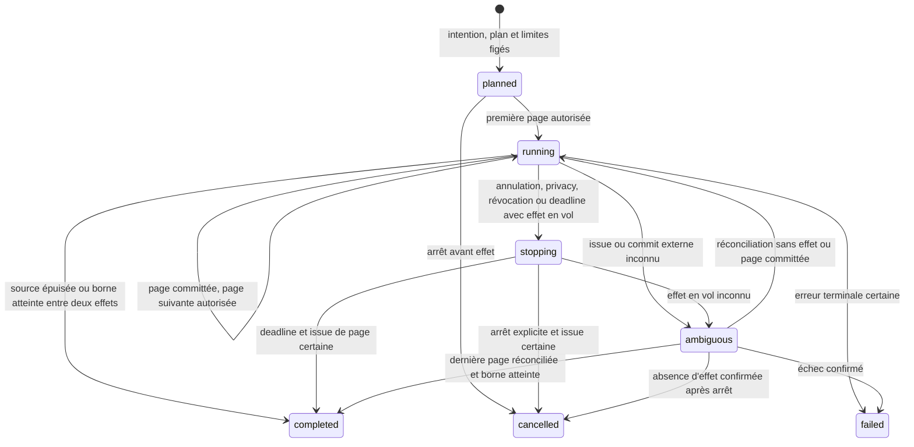

# RFC-0008 — Génération provider-neutral de datasets

- Status: **Accepted**
- Author(s): Kurobara maintainers
- Decision owner: Leandre Desmaretz
- Implementation owner: unassigned
- Created: 2026-07-21
- Supersedes: none
- Related ADRs: ADR-0005, ADR-0006, ADR-0007

## Summary

Kurobara accepte un second mode de matérialisation d'un `Dataset` : une
génération paginée depuis une capability provider-neutral, en plus de l'import
CSV ou JSONL existant. `DatasetGeneration` reste distinct de `DatasetImport` ;
les deux convergent vers une lecture commune de l'origine et de la readiness du
dataset, sans fabriquer de faux import.

Une génération fige avant le premier effet sa query normalisée, sa capability,
sa route ordonnée, son autorité, son budget, sa deadline et ses limites. Chaque
page externe devient un `Run` canonique et réutilise les garanties d'effet
existantes : `operation_key`, tentative, réservation, règlement, résultat
ambigu, artifact et réconciliation. Le checkpoint atomique d'une page conserve
son curseur, ses records normalisés, sa lineage et la référence de coût réglée.
Une page committée n'est jamais redemandée aveuglément.

Cette décision rend possible un dataset source d'entreprises puis un dataset
dérivé de contacts liés à leurs records d'entreprise. Elle ne définit pas les
filtres métier de ces capabilities, n'admet aucun provider et ne crée aucune
route REST, SDK ou CLI. Ces contrats et leurs adapters restent portés par les
tickets suivants.

## Current reality

Sur la révision qui accepte ce RFC :

- `Dataset`, `Field` et `Record` sont implémentés comme primitives immuables ;
- `datasets.import@1.0.0` matérialise les records par lots CSV ou JSONL ;
- `DatasetPersistencePort.getDataset()` retourne un `StoredDataset` dont la
  readiness dépend directement de `DatasetImportProgress` ;
- `recipe apply`, `dataset export` et `recipe export` exigent un import
  `completed` ;
- `dataset_records` référence durablement `dataset_imports` ;
- le runtime de `Run` et `Attempt` implémente déjà route, `operation_key`,
  réservation, règlement, retry, fallback et ambiguïté pour les effets
  provider ;
- `UsageEntry` et `ResultManifest` rendent le règlement durable, mais le bridge
  courant ne conserve pas encore une référence d'opération ou un reçu provider
  optionnel ;
- aucun aggregate, port, schéma, migration ou endpoint de
  `DatasetGeneration` n'existe encore.

Le statut `Accepted` de ce document enregistre donc une architecture cible. Il
ne prouve aucune recherche d'entreprise ou de contact exécutable.

## Problem

Le modèle actuel suppose qu'un fichier est toujours la source d'un dataset.
Cette hypothèse apparaît dans le port de persistence, les foreign keys des
records et les use cases consommateurs. Réutiliser ces chemins en créant un
`DatasetImport` artificiel pour une réponse provider produirait plusieurs
mensonges : aucun fichier ni codec n'existe, le hash source n'a pas la même
sémantique, un curseur n'est pas un batch d'import et une dépense externe ne
peut pas être traitée comme une écriture locale sans effet.

Créer à l'inverse un stockage et un lifecycle indépendants pour les datasets
générés dupliquerait records, exports, recettes, isolation et règles de
readiness. Les clients devraient connaître l'origine pour savoir comment
consommer un dataset, alors que cette différence ne doit compter que pour son
audit et sa reprise.

La génération ajoute aussi des risques absents de l'import : pagination
provider, quota, coût par page ou record, curseur opaque, réponse perdue,
fallback incompatible et redémarrage entre l'effet et son commit.

## Goals and non-goals

### Goals

- distinguer durablement `DatasetImport` et `DatasetGeneration` ;
- donner aux deux origines une readiness commune pour les use cases aval ;
- figer une intention provider-neutral et toutes ses limites avant dépense ;
- commit atomiquement page, records, lineage, curseur et références au coût
  déjà réglé par le Run ;
- reprendre depuis le dernier fait certain sans double requête ni double record ;
- borner fallback, retry, annulation, budget, deadline et ambiguïté ;
- produire un dataset source puis un dataset dérivé avec lineage record à
  record ;
- garder identifiants, reçus et curseurs provider dans une surface interne
  restreinte ;
- préserver PostgreSQL comme vérité métier et l'orchestrateur comme mécanisme.

### Non-goals

- choisir Hunter, Apollo, PDL ou un autre provider ;
- définir les filtres exacts d'entreprise ou de contact ;
- introduire un query DSL SQL, Elasticsearch ou propre à un provider ;
- autoriser union ou fédération multi-provider dans une même génération ;
- résoudre la déduplication probabiliste entre entreprises ou personnes ;
- exposer des payloads provider bruts, des coordonnées incidentes ou des
  secrets ;
- créer une UI, un planner LLM, un crawler web ou un second orchestrateur ;
- implémenter les contrats, ports, migrations, routes ou adapters décrits ici.

## Proposal

### Origine et readiness communes

Chaque dataset possède exactement une `DatasetMaterialization`, distincte du
payload public minimal de `Dataset` :

```text
DatasetMaterialization
├─ workspace_id
├─ materialization_id
├─ dataset_id
├─ origin_kind: import | generation
├─ origin_id: import_id | generation_id
├─ state: building | ready | failed | cancelled | ambiguous
├─ revision
├─ schema_hash
├─ record_count
├─ rejected_count
├─ content_hash?
├─ coverage?
│  ├─ status: complete_for_declared_source | bounded | unknown
│  └─ basis: imported_source | locked_provider_route
├─ completion_reason?
└─ completed_at?
```

`DatasetImport` et `DatasetGeneration` gardent leurs propres identités,
contrats, compteurs et journaux. La matérialisation ne remplace pas ces
aggregates ; elle fournit seulement la précondition commune des consommateurs.

| Origine | État de l'origine | Matérialisation |
| --- | --- | --- |
| Import | `running` | `building` |
| Import | `completed` | `ready` |
| Import | `failed` | `failed` |
| Génération | `planned`, `running`, `stopping` | `building` |
| Génération | `ambiguous` | `ambiguous` |
| Génération | `completed` | `ready` |
| Génération | `failed` | `failed` |
| Génération | `cancelled` | `cancelled` |

Seul `ready` autorise `recipe apply`, une génération dérivée, `dataset export`
ou `recipe export`. Ces use cases lisent la readiness commune et ne branchent
pas sur `origin_kind`. Les lectures d'audit peuvent toujours retrouver l'import
ou la génération exacts.

Un dataset `ready` signifie que son contenu durable est immuable et utilisable,
pas que la source mondiale a été parcourue exhaustivement. Un import terminé
reçoit `complete_for_declared_source/imported_source`, même si son compteur
`rejected_count` est non nul ; cela signifie que tout le fichier déclaré a été
parcouru, pas que toutes ses lignes étaient valides. Une génération épuisée
reçoit `complete_for_declared_source/locked_provider_route`. Toute terminaison
sur une borne reçoit `bounded`. `coverage` et `completion_reason` suivent le
dataset et ses projections ; une limite atteinte ne peut jamais être présentée
comme « toutes les entreprises ».

Quand la matérialisation devient `ready`, `content_hash` couvre la suite
ordonnée des couples `(record_id, content_hash)`. Sa révision et ce hash rendent
un snapshot vérifiable sans réencoder le contenu des records. `coverage` est
également obligatoire à cet état ; elle peut rester absente tant que la source
ou le provider effectif n'est pas encore certain.

### Aggregate `DatasetGeneration`

Une génération porte au minimum :

- `generation_id`, `workspace_id` et `dataset_id` ;
- la définition du dataset et ses fields, avec `schema_hash` ;
- la capability et sa version ;
- le schéma de query, la query normalisée fermée et son hash ;
- le snapshot de policy et la route ordonnée de candidats compatibles ;
- l'enveloppe d'autorité, les permissions et les classes de données ;
- le budget, l'unité, la quote et leur niveau `hard`, `estimated` ou `unknown` ;
- la deadline et les limites `max_records`, `max_pages`, `max_calls` et
  l'éventuelle taille de page admise ;
- un éventuel `DerivedDatasetSource` ;
- l'état, les compteurs, le provider verrouillé, la dernière page certaine, les
  liaisons exactes page-vers-Run et la raison d'arrêt.

L'identité d'intention hashée couvre toutes ces valeurs, à l'exception des
compteurs et états produits après acceptation. Rejouer le même
`generation_id` avec la même intention relit la génération ; une divergence
produit un conflit sans effet externe.

La query publique est validée par le schéma versionné de la capability. Elle
ne contient ni endpoint, ni provider, ni langage arbitraire. Les adapters
traduisent cette query à leur frontière et échouent fermés lorsqu'un filtre
obligatoire n'est pas représentable.

### Lifecycle de génération



`completed`, `failed` et `cancelled` sont terminaux. `ambiguous` ne l'est pas et
interdit toute nouvelle page, dépense ou conclusion incompatible avant
réconciliation.

Une terminaison `completed` porte une raison fermée :

- `source-exhausted`, avec
  `coverage=complete_for_declared_source/locked_provider_route` ;
- `max-records`, `max-pages`, `max-calls`, `budget-bound` ou
  `deadline-bound`, avec `coverage=bounded` ;
- `empty-source`, avec zéro record et une exhaustion certaine.

Une borne est évaluée avant chaque nouvel effet. Lorsqu'elle devient vraie
après une page certaine, la génération peut terminer proprement et rendre ses
records prêts. Une deadline atteinte entre deux effets termine donc
`completed/deadline-bound`. Une annulation explicite, une règle privacy ou une
révocation reste `cancelled` et ne rend pas le dataset consommable. Une erreur
provider certaine reste `failed`.

### Page, curseur et frontière d'effet

Une page logique possède `generation_id`, un `page_sequence` monotone, un
`run_id` canonique et un `operation_key` stable. Une génération dérivée ajoute
une `source_partition_key` obligatoire : en P0 Contacts, il s'agit du
`company_record_id` Kurobara issu de la sélection figée. Son journal interne
relie :

- hash de la query et version de capability ;
- route et provider sélectionné ;
- ordinal et clé de partition source, lorsque la génération est dérivée ;
- curseur d'entrée opaque ou marqueur de première page ;
- tentatives et classification de leurs issues ;
- hash du contenu normalisé ;
- compteurs returned, accepted, duplicate et rejected ;
- curseur de sortie opaque ;
- état `source_partition_completed` afin qu'une page vide prouve elle aussi
  quelle partition a été parcourue ;
- réservation, `usage_entry_id`, preuve de règlement et éventuel
  `provider_receipt_ref` ;
- records et lineage committés par cette page.

Les curseurs, identifiants provider et éventuels reçus sont des données internes
restreintes. Les logs ne conservent que leurs identités Kurobara ou hashes
expurgés. Ils ne sont placés ni dans un `Record`, ni dans un CSV/JSONL public,
ni dans une erreur contractuelle.

Le lifecycle d'une page est fermé :

```text
planned → run_created → executing → ready_to_checkpoint → committed
                         ├→ failed
                         └→ ambiguous → ready_to_checkpoint | failed
                                      ├→ executing
                                      └→ cancelled_before_effect
planned | run_created ────────────────→ cancelled_before_effect
```

`committed`, `failed` et `cancelled_before_effect` sont terminaux pour cette
page. `ambiguous` interdit une autre page. Une preuve autoritative d'absence
d'effet permet de reprendre `executing` sous le même `operation_key`, ou de
passer `cancelled_before_effect` si un arrêt est demandé. Une page vide certaine
est un succès normalisé avec `items=[]` et `has_more=false`, pas une erreur
retryable.

L'état `ambiguous` de la page reflète en premier lieu son `Attempt` ou son
`StepRun`. Le Run canonique peut rester `running` pendant leur réconciliation et
permettre cette reprise. Si le Run lui-même entre dans `RunAmbiguous`, sa
résolution reste terminale conformément à son lifecycle : `completed`, `failed`
ou `cancelled`, jamais retour à `running`.

Le tuple `(generation_id, source_partition_key?, page_sequence)` crée ou
retrouve exactement le même `Run`. La génération coordonne les pages et leur
readiness ; elle ne remplace pas le lifecycle d'effet du Run. Le plan et l'input
du Run contiennent la query normalisée, la partition source éventuelle, le
curseur d'entrée, la route autorisée et la borne de cette page.

Avant l'appel externe, une transaction courte :

1. recharge la génération et la dernière page certaine ;
2. vérifie autorité, révocation, deadline, limites et provider lock ;
3. fournit au plan du Run la route admissible complète pour la première page,
   ou une route singleton contenant le provider verrouillé pour les suivantes ;
4. crée ou retrouve la liaison vers le Run exact de cette page sans sélectionner
   elle-même un candidat ;
5. persiste plan, input, identité du curseur d'entrée et outbox du Run sans
   consommer deux fois l'autorité globale.

Le runtime du Run reste l'unique autorité qui sélectionne le candidat et
persiste sa `RoutingDecision`. Le worker crée ensuite une tentative, réserve le
coût, appelle l'adapter hors transaction puis règle, libère ou marque l'effet
ambigu. Un succès produit un artifact de page normalisé, borné, intègre et
restreint qui porte records candidats, curseur suivant, exhaustion et hash. En
P0, `page_size` et les champs demandés doivent garantir que cet artifact
respecte la borne actuelle de 65 536 octets ; un artifact objet plus grand est
une extension séparée. `UsageEntry`, preuve de règlement, artifact et issue du
Run deviennent durables avant le checkpoint de génération. Une référence ou un
reçu provider reste optionnel et n'est jamais inventé.

Une transaction courte de checkpoint lit ce résultat durable puis :

1. vérifie que Run, tentative, `RoutingDecision`, artifact, `ResultManifest` et
   `UsageEntry` visent la page attendue, ainsi que le reçu provider s'il existe ;
2. insère la page, son hash et ses références de coût réglées ;
3. insère les records nouveaux dans leur ordre déterministe et leur attribue un
   `record_ordinal` stable ;
4. insère leur lineage et les décisions de duplicate/rejet ;
5. persiste le curseur de sortie, la partition source et son état de complétude ;
6. avance compteurs, dernière page et provider lock ;
7. publie l'outbox de page suivante seulement si une nouvelle autorisation est
encore possible.

L'ordre global généré est celui de `(page_sequence, candidate_position)` après
normalisation. Seuls les records uniques acceptés reçoivent le prochain
`record_ordinal`; une décision de duplicate ou de rejet conserve sa position de
candidat mais ne décale ni ne réécrit les ordinaux déjà committés.

Pour une génération dérivée, le checkpoint n'avance vers la partition source
suivante qu'après une exhaustion certaine de la partition courante. Une page
vide committée conserve `source_partition_key` et
`source_partition_completed=true`; un restart peut donc la relire sans rappeler
ni sauter l'entreprise correspondante.

Si ce commit est confirmé, une redelivery relit la page par son identité et son
hash et retourne `unchanged`. Un contenu différent pour la même page est un
conflit. Une panne après succès du Run mais avant checkpoint relit l'artifact
durable et ne rappelle jamais le provider. Si la réponse provider ou le
règlement reste inconnu, l'`Attempt` ou le `StepRun`, la page et la génération
deviennent `ambiguous` ; le Run reste `running` tant qu'une reprise est encore
possible. Un `RunAmbiguous` explicite attend au contraire une résolution
terminale. Dans tous les cas, le cursor n'avance pas et aucune page suivante
n'est appelée avant readback ou lookup.

Un vrai retry réutilise l'`operation_key` de la page et ajoute une tentative
selon la policy existante. Une redelivery de la même tentative conserve aussi
son `attempt_id`. Le mode d'idempotence et de lookup déclaré par le provider
reste déterminant ; aucune absence d'effet n'est inventée localement.

### Provider lock et fallback

La route ordonnée et ses critères de compatibilité sont immuables dès
`planned`. Le provider sélectionné peut changer uniquement tant que zéro page
a été committée et qu'aucun effet n'a produit ou ne peut encore produire un
résultat, et seulement après une issue certaine compatible avec la policy :
rejet avant effet, erreur certaine sans résultat ou absence d'effet prouvée.

Le premier commit de page écrit `locked_provider`. À partir de cette frontière,
pagination, coût et sémantique de couverture restent attachés à ce provider.
Un succès ou un effet réconciliable survenu avant ce checkpoint interdit déjà
le fallback ; le checkpoint rend ensuite le lock explicite et durable.
Un retry peut utiliser le même provider ; aucun fallback, union ou reprise sur
un second provider n'est autorisé dans cette génération. Une amélioration
multi-source crée une nouvelle génération et suit un RFC ou une policy
explicitement compatible.

Une timeout, un reset, un crash, une réponse perdue ou un commit inconnu ne
sont jamais une raison de fallback. Ils conduisent à `ambiguous`.

### Identité des records et duplicates

Le contrat de capability définit une normalisation déterministe et une
stratégie de `record_id` stable pour la même page rejouée. Le P0 ne réalise
aucune fusion probabiliste globale.

- même `record_id` et même hash normalisé : duplicate idempotent, sans seconde
  insertion ;
- même `record_id` et contenu divergent : conflit, sans réécriture du record ;
- doublon entre pages : décision durable avec la page observée, sans modifier
  le premier record ;
- nom, domaine ou identifiant provider seuls ne deviennent pas une clé
  universelle par ce RFC.

Les détails d'identité entreprise et contact restent à définir par
`KRB-COMPANY-001` et `KRB-CONTACT-001`.

### Dataset source et dataset dérivé

Une génération source ne référence aucun dataset parent. La première capability
prévue produit un dataset Entreprises.

Une génération dérivée contient un `DerivedDatasetSource` immuable :

- `source_dataset_id` et son `schema_hash` ;
- le tuple exact `source_materialization_id`, `source_revision` et
  `source_content_hash` de sa matérialisation ready ;
- la liste ordonnée des couples source `(record_id, content_hash)` et son
  `source_selection_hash` ;
- le type de relation versionné.

Elle est refusée si le dataset source n'est pas `ready`, appartient à un autre
workspace ou si son snapshot ne correspond plus. Chaque contact P0 conserve une
lineage Kurobara vers exactement un `company_dataset_id` et un
`company_record_id`. Ces identités Kurobara peuvent alimenter une projection ;
les identifiants provider sous-jacents restent internes.

La relation source-enfant est append-only. Elle ne copie pas silencieusement
tout le record entreprise dans le contact et ne permet pas de cycle de
datasets.

### Budget et coût

Les compteurs de cardinalité et le ledger financier sont distincts mais reliés
au même plan immuable. Une page ne commence que si ses bornes de records, pages,
appels, deadline et coût permettent encore un effet.

Une génération P0 utilise une seule unité provider-native — par exemple
`requests`, `pages`, `credits` ou `records` — figée dans son plan. Aucune
conversion silencieuse entre unités ou devises n'est admise. Le budget global
de génération borne l'allocation des Runs de page ; chaque Run conserve ensuite
ses réservations et règlements exacts dans cette même unité.

Tous les candidats d'une route de fallback doivent annoncer la même unité,
échelle et sémantique de quote et de règlement. Si cette compatibilité ne peut
pas être prouvée avant acceptation, le plan ne contient qu'un provider ; un
fallback inter-unités exige une génération ou une décision ultérieure distincte.

Le coût exact appartient à l'opération ou au bundle facturé. La lineage interne
des records et fields référence l'effet, la tentative, le `ResultManifest`,
l'`UsageEntry` et l'éventuel reçu qui les ont produits ; une allocation par
record ou field est `derived/shared` et n'est jamais additionnée comme une
seconde dépense.

Une quote `unknown` échoue fermée sauf policy explicite, non interactive, avec
un plafond dur exécutable. Une issue ambiguë conserve sa réservation jusqu'à
réconciliation. Atteindre un budget avant l'effet peut terminer proprement une
génération déjà matérialisée comme `bounded` ; dépasser une réservation ou
inventer un coût après coup reste interdit.

### Annulation, deadline et reprise

Une demande d'arrêt est persistée et ferme immédiatement l'autorisation de la
page suivante. Les pages déjà committées ne sont ni supprimées ni réécrites.
Avant le seuil durable d'effet de la page courante, son Run peut être annulé et
sa réservation libérée. Après ce seuil, l'arrêt ne propage jamais `runs.cancel`
au Run : la génération reste `stopping`, laisse le Run régler son issue et ne
crée aucune autre page. Elle ne devient `ambiguous` que si cette issue devient
inconnue. Sans effet en vol, elle converge directement vers `cancelled`.

Si un Run de page engagé réussit après la demande d'arrêt, son artifact et son
coût sont certains : la page payée est checkpointée, puis la génération termine
`cancelled`. La matérialisation reste non-ready en P0 malgré ces records
partiels. L'arrêt ne transforme jamais un résultat certain en absence d'effet.

La deadline est une borne, pas une annulation explicite. Si elle expire pendant
un effet déjà engagé, la génération ferme la page suivante et reste `stopping`
jusqu'à une issue certaine. Un succès est checkpointé ; une absence ou un échec
certain conserve les pages précédentes. La génération termine ensuite
`completed/deadline-bound` et sa matérialisation `ready` avec
`coverage=bounded`. Une issue inconnue reste `ambiguous` jusqu'à
réconciliation.

Un restart recharge PostgreSQL, relit la dernière page committée et son cursor,
puis reprend seulement si l'état et les bornes l'autorisent. Hatchet ou un autre
orchestrateur transporte le travail ; son historique ne remplace ni pages,
records, coûts, cursor, provider lock ou arrêt durable.

### Commandes, événements et résultat lisible

La couche application possède au minimum les commandes internes
`PlanGeneration`, `CreateGeneration`, `CreateNextPageRun`, `CheckpointPage`,
`RequestGenerationStop` et `ReconcileGenerationPage`. Une redelivery de commande
réutilise son identité ; elle ne crée ni nouveau Run, ni nouvelle page.

Les faits durables minimaux sont `GenerationPlanned`, `PageRunCreated`,
`PageCheckpointed`, `GenerationProviderLocked`, `GenerationStopRequested`,
`GenerationBecameAmbiguous`, `GenerationCompleted`, `GenerationFailed` et
`GenerationCancelled`. Leurs noms publics éventuels seront versionnés dans le
catalogue au moment de l'implémentation.

`DatasetGenerationResult` est un read model provider-neutral et borné. Il expose
au minimum génération, dataset, capability, mode source/dérivé, état,
terminalité, pages, appels, records accepted/duplicate/rejected, coût agrégé,
coverage et raison d'arrêt sûre. Il n'expose ni cursor, provider ID, receipt,
payload, DSL traduit ou diagnostic brut. Une lecture ne déclenche jamais de
page, de réservation ou de télémétrie métier supplémentaire.

## Public contracts and compatibility

Ce RFC fixe les concepts partagés suivants, pas encore leurs JSON Schema :

- `DatasetMaterialization` ;
- `DatasetGenerationQuery` typé par capability ;
- `DatasetGenerationPlan` ;
- `DatasetGeneration` et `DatasetGenerationResult` ;
- `DatasetGenerationPage` interne ;
- `DatasetRecordLineage`.

Les opérations publiques métier ne reçoivent pas un champ `provider_query` ou
un objet libre. `organizations.discover@1.0.0` et
`contacts.discover@1.0.0`, définis dans des tickets ultérieurs, réutiliseront
une enveloppe de génération commune et leur propre query fermée.

Plan, run, get/watch, cancel et export doivent partager les mêmes use cases
entre REST, SDK TypeScript et CLI JSON non interactive. Leur nom, transport et
version restent à décider avec les contrats concrets ; ce RFC ne crée aucune
route par le texte.

Tout export qui accepte un dataset généré doit joindre ou référencer une
métadonnée immuable contenant au minimum `materialization_id`, `revision`,
`content_hash`, `coverage.status`, `coverage.basis` et `completion_reason`. Le
transport exact — enveloppe, headers sûrs ou manifest séparé — reste au ticket
de projection, mais ces valeurs ne peuvent pas être omises. L'export courant
doit donc être versionné ou étendu avant d'accepter une matérialisation générée.

La migration de `dataset-import-incomplete` vers un problème origin-neutral
comme `dataset-not-ready` modifie un contrat local expérimental. Elle exige une
régénération complète du catalogue, des fixtures et des projections. Après
publication, toute rupture suivra la politique de versioning et un RFC.

## Security, privacy and agent authority

- le workspace vient de l'acteur authentifié et qualifie chaque identité ;
- l'enveloppe d'autorité borne capability, classes de données, budget,
  deadline, provider admissible et nombre d'effets ;
- une génération dérivée ne traverse jamais un workspace ;
- query et payload provider sont des entrées hostiles validées à leur frontière ;
- cursors, IDs, receipts et diagnostics provider sont restreints et expurgés ;
- aucun payload provider brut n'est conservé par défaut ; une rétention future
  exigerait classification, chiffrement, TTL et droit d'usage explicites ;
- suppression, opt-out ou révocation ferment les nouveaux effets ; leur
  propagation durable aux records de contact relève de `KRB-PRIVACY-002` ;
- l'agent ne choisit pas un provider hors route, n'élargit pas ses limites et
  n'accède ni à PostgreSQL, ni aux secrets, ni à l'orchestrateur.

## Data, operations and rollback

L'implémentation devra introduire une représentation origin-neutral de la
matérialisation et séparer la lineage des records de celle de l'import. Le
schéma SQL exact reste au ticket d'implémentation, mais il doit garantir :

- une seule origine par dataset ;
- backfill déterministe des imports existants sans réencoder les records ;
- `record_ordinal` backfillé depuis l'ordre relatif `item_number`, puis jamais
  réécrit ;
- coverage d'import backfillée en
  `complete_for_declared_source/imported_source`, avec ses compteurs acceptés et
  rejetés conservés ;
- références d'import conservées pour leur audit ;
- records et fields toujours immuables après readiness ;
- pages, tentatives, références de règlement, reçus optionnels et lineage de
  génération append-only ;
- isolation workspace dans chaque clé et foreign key ;
- aucune insertion de record généré sous un faux `import_id`.

Le port de lecture devient origin-neutral. Les ports d'import gardent leurs
méthodes spécialisées ; de nouveaux ports de génération portent plan, page,
cursor, réconciliation et résultat. Une interface générique ne doit pas devenir
un sac d'options dépendantes du provider.

Les gardes SQL import-only de `streamRecords`, `isFieldSetComplete` et de
l'enregistrement d'une application de recette doivent toutes lire la
matérialisation `ready`. Une modification du seul `StoredDataset` ne satisfait
pas la migration. Le ticket d'implémentation doit aussi préserver
`ResultManifest` et `UsageEntry` comme preuves toujours présentes et introduire
une référence provider restreinte seulement lorsque l'adapter en fournit une ;
le bridge courant ne conserve pas encore `externalOperationReference`.

Avant toute génération persistée, un rollback peut retirer les nouvelles
surfaces et le backfill. Après la première génération, le rollback doit
préserver lecture, audit et export des datasets ready et ne peut supprimer
pages, coûts ou lineage. Une migration incompatible suit alors un nouveau RFC.

## Alternatives

- **Créer un faux import par réponse provider** : rejeté ; il confond fichier,
  codec, hash source et effet facturable.
- **Créer une seconde famille de datasets générés** : rejeté ; elle dupliquerait
  recettes, exports et isolation.
- **Utiliser un `Run` par génération entière** : rejeté ; le DAG d'un Run est
  figé avant son démarrage alors que le curseur détermine dynamiquement la page
  suivante. La génération coordonne plusieurs Runs de page canoniques.
- **Un `Run` par record découvert** : rejeté ; la facturation et l'idempotence
  sont souvent portées par page ou bundle et ce modèle multiplierait les effets
  après la réponse.
- **Changer de provider au milieu d'un dataset** : rejeté pour le P0 ; cursor,
  couverture et coûts cesseraient d'être comparables.
- **Stocker la réponse provider brute pour rejouer** : rejeté par défaut ; cela
  augmente exposition, rétention et dépendance contractuelle.
- **Lancer la recherche synchroniquement dans l'API** : rejeté ; pagination,
  restart, annulation et ambiguïté exigent un progrès durable.

## Risks

- une matérialisation commune ajoute une migration structurante sur des tables
  déjà immuables ; le backfill et le rollback doivent être testés sur un clone ;
- certains providers n'offrent ni idempotence ni lookup : leur admission devra
  assumer plus d'états ambigus et aucun retry automatique ;
- le runtime courant ne propage pas encore automatiquement toute ambiguïté de
  `StepRun` vers l'état du Run ; le contrôleur devra observer tentative et step,
  pas seulement le snapshot agrégé ;
- `coverage=bounded` peut être mal interprété si les exports omettent la raison
  d'arrêt ; les manifests doivent la conserver ;
- une page volumineuse peut dépasser la mémoire ou les limites de record avant
  commit ; l'adapter et la normalisation doivent appliquer des bornes réelles ;
- la déduplication exacte évite les fusions fausses mais peut conserver des
  doublons métier ; une stratégie multi-source reste volontairement différée ;
- le cursor peut contenir une donnée sensible ou un token opaque ; sa surface
  de stockage et ses logs demandent une revue sécurité spécifique.

## Verification plan

1. tester la matrice import/génération vers readiness commune sans régression
   d'import ;
2. migrer et backfiller un dataset importé puis prouver recipe apply et exports
   byte-identiques ;
3. tester hash d'intention, replay identique et conflit de génération ;
4. injecter un crash avant effet, après effet, avant commit et après commit de
   page ;
5. prouver qu'une page committée n'est jamais rappelée et qu'un commit ambigu
   bloque la suivante ;
6. tester retry même provider, fallback avant première page et refus après
   provider lock ;
7. tester records duplicate identiques et divergents entre deux pages ;
8. vérifier sous concurrence les caps et `spent + reserved <= budget` ;
9. tester annulation, deadline, budget, source vide et source épuisée ;
10. créer un dataset Entreprises source puis un dataset Contacts dérivé et
    relire chaque lien entreprise-contact, y compris une partition sans contact
    après restart ;
11. vérifier que cursors, IDs, receipts et payloads provider n'apparaissent dans
    aucun contrat public, export, fixture ou log ;
12. prouver la parité des futurs contrats via REST, SDK et CLI depuis un clone
    propre.

## Open questions

- le seuil de volume qui justifiera un stockage de page normalisée séparé des
  records ;
- le format d'un manifest d'export qui portera coverage et révocations sans les
  répéter dans chaque ligne, sans pouvoir omettre la métadonnée minimale décidée
  ci-dessus ;
- la politique de rétention interne des cursors et receipts après terminaison.

Ces questions ne changent ni la séparation import/génération, ni la readiness,
ni la frontière d'effet décidées ici.

## Review record

Trois revues indépendantes en lecture seule ont challengé le modèle sous les
angles dataset/migration, effet/coût/reprise et processus RFC. Elles ont conduit
à retenir explicitement :

- une readiness origin-neutral plutôt qu'un faux import provider ;
- un Run canonique mono-step par page plutôt qu'un second moteur d'effets ;
- le règlement et l'artifact durables avant le checkpoint de génération ;
- le runtime Run comme unique autorité de routing, sans choix provider parallèle
  dans le contrôleur de génération ;
- l'arrêt post-effet sans propagation de `runs.cancel` au Run engagé ;
- le blocage fail-closed sur ambiguïté et le provider lock à la première page ;
- la borne actuelle de 65 536 octets pour l'artifact de page P0 ;
- une coverage origin-neutral, un ordre canonique et une migration qui backfill
  les imports sans réencoder leurs records ;
- `UsageEntry` et `ResultManifest` obligatoires, avec reçu provider optionnel.

Aucune objection bloquante ne reste ouverte. Les contrats métier, providers et
migrations concrets demeurent volontairement délégués aux tickets dépendants.

## Decision

**Accepted le 2026-07-21.** Le decision owner retient une
`DatasetMaterialization` origin-neutral et un aggregate distinct
`DatasetGeneration`. Query, route, autorité, budget, deadline et limites sont
figés avant effet. Chaque page s'exécute par un Run canonique, réutilise
l'identité, le ledger, l'artifact et l'ambiguïté du runtime existant, puis
checkpoint atomiquement records, cursor, lineage et références de coût.

Le provider devient immuable après le premier commit de page ; avant cette
frontière, un fallback reste possible uniquement après une absence d'effet ou
une erreur certaine compatible. Les générations dérivées conservent la lineage
exacte du dataset et du record source. Aucun provider, contrat public concret,
route ou implémentation n'est déclaré disponible par cette acceptation.
